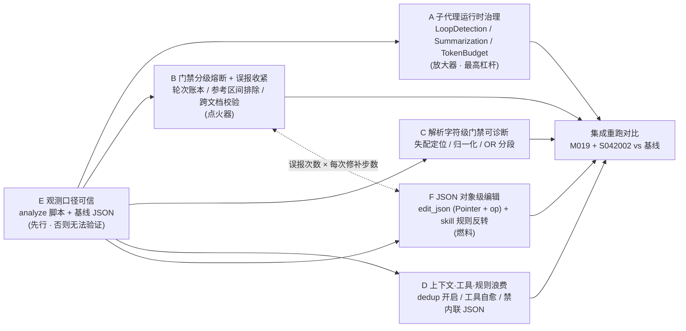

# Eligibility-Screener 门禁死循环与子代理上下文治理优化计划

> 来源（会话执行分析）：
> - [`../eligibility-screener-monitoring-session-2d628340.md`](../eligibility-screener-monitoring-session-2d628340.md)（患者 M019，17.9M token / 33 min）
> - [`../eligibility-screener-monitoring-session-d393714d.md`](../eligibility-screener-monitoring-session-d393714d.md)（患者 S042002，27.6M token / 46 min）
>
> 关联计划：[`./eligibility-screener-monitoring-optimization-plan.md`](./eligibility-screener-monitoring-optimization-plan.md)、[`./criteria-token-saving-v1.2.md`](./criteria-token-saving-v1.2.md)、[`./subagent-timeout-watchdog-optimization-plan.md`](./subagent-timeout-watchdog-optimization-plan.md)、[`./eligibility-screener-json-object-edit-tool-plan.md`](./eligibility-screener-json-object-edit-tool-plan.md)（F 层 `edit_json` 的独立详案，本计划收敛其验收口径与排期）
>
> 日期：2026-08-09（CST）
>
> 状态：**待评审 / 未实施（本次仅落计划，未改任何代码、配置、skill 脚本或测试）**

---

## 目录

- [1. 背景与问题陈述](#1-背景与问题陈述)
- [2. 核心新发现：子代理运行时缺三道防线](#2-核心新发现子代理运行时缺三道防线)
- [3. 对两份会话分析结论的三处更正](#3-对两份会话分析结论的三处更正)
- [4. 其它已核对的现状事实](#4-其它已核对的现状事实)
- [4bis. F 层专项现状：`apply_json_patches` 已存在一半，skill 规则反向阻拦](#4bis-f-层专项现状apply_json_patches-已存在一半skill-规则反向阻拦)
- [4ter. `read_file_dedup` 实现审计（2026-08-10）](#4ter-read_file_dedup-实现审计2026-08-10)
- [5. 现状基线与验收目标](#5-现状基线与验收目标)
- [6. 已确认的三项决策](#6-已确认的三项决策)
- [7. 方案分层（A–F）](#7-方案分层af)
- [8. 问题 → 方案总览](#8-问题--方案总览)
- [9. 详细方案](#9-详细方案)
- [10. 任务分解（19 个任务）](#10-任务分解19-个任务)
- [11. 验证计划](#11-验证计划)
- [12. 明确不做 / 暂缓](#12-明确不做--暂缓)
- [13. 风险评估](#13-风险评估)
- [14. 涉及文件清单](#14-涉及文件清单)
- [15. 决策点（供评审确认）](#15-决策点供评审确认)

---

## 1. 背景与问题陈述

两次连续的完整入排筛查会话 `2d628340`（患者 M019）→ `d393714d`（患者 S042002）呈现**持续恶化**：

- 总 token **17.9M → 27.6M（+54%）**
- 总耗时 **33 min → 46 min（+39%）**
- 判定阶段占总 token 比 **46% → 60%**
- 新增 **2 个 failed task 的失败级联**（IN 轨判定 6.36M failed → 重试 5.21M；EX 轨 QC 1.27M failed → 重试 1M）

关键事实：上一轮分析（`2d628340`）已把 `uncertain_recheck` 误报 + 门禁无熔断定为 **P0**，但**未落地**，因此在 `d393714d` 中**完全复发并放大**（`uncertain_recheck` 单 task 仍跑 8 次，`str_replace` 修补链绵延 83 步仍未收敛）。同时新增两类问题：解析阶段字符级门禁循环（EX 轨解析 863k/23 步 → 2.81M/54 步，3 倍恶化）与 35% 的空 AI 步骤。

**本计划的目标**：把"判定/解析阶段反复跑门禁—改产物—再跑门禁"的失控循环从**根因**上掐断，并让收益可被可信地度量。

---

## 2. 核心新发现：子代理运行时缺三道防线

**判定阶段单 task 6.36M token 不是门禁误报单独造成的。**

`build_subagent_runtime_middlewares`（`backend/packages/harness/deerflow/agents/middlewares/tool_error_handling_middleware.py:225-274`）组装的子代理中间件链里，**没有** LoopDetection、**没有** Summarization、**没有** TokenBudget：

| 中间件 | lead agent | subagent | 后果 |
|---|---|---|---|
| `LoopDetectionMiddleware`（warn=3 / hard=5） | ✅ `agents/lead_agent/agent.py:366-369` | ❌ 未接入 | 12 次同参 `uncertain_recheck.py` 无人打断 |
| `DeerFlowSummarizationMiddleware` | ✅ `agents/lead_agent/agent.py:79-129` | ❌ 未接入 | 83 步上下文单调增长，平均 76k input/次 |
| `TokenBudgetMiddleware` | ✅ `agents/lead_agent/agent.py:371-374` | ❌ 未接入 | 单 task 烧到 6.36M 无硬停，failed 后 lead 重试翻倍 |

**结论定性：门禁误报是点火器，子代理无压缩无熔断是放大器。**

只修脚本（B 层）会让循环轮数变短，但每一步的 input 仍是十几万量级——因为子代理上下文从不压缩，83 步意味着近似二次增长的累计 input。反过来，只修运行时（A 层）会把爆炸封顶，但点火器仍在，判定质量依旧被"绕门禁"行为污染。**A、B 两层必须同批推进。**

值得注意的是，`config.yaml:490` 附近的 `token_budget` 注释里已经写明"根治方向仍是子代理 token 治理（子代理级 summarize / 限制单子代理 input），而非无限抬高总预算"——这个方向早已被识别，只是一直没有实施。

**补充：即便接入 LoopDetection 也未必生效。** `config.yaml:459-463` 的 `window_size: 20` 是滑动窗口：在 49 次 bash 夹杂 `read_file`/`grep` 的真实场景下，两次同参 `uncertain_recheck.py` 调用的间隔常常超过 20 次工具调用，哈希会滑出窗口，累计次数永远到不了 `warn_threshold`。因此接入的同时必须把识别口径改成 **per-(thread, run, task) 累计计数**，滑窗只用于判定"近期密集度"。

---

## 3. 对两份会话分析结论的三处更正

两份会话分析中有三条结论与当前代码不符。**若不更正，方案会落到不存在的问题上（或落到一个会打破子代理隔离的动作上）。**

### 3.1 `read_file_dedup` 不是"未提交 / 纯纸面"，但**也不是改一行配置就能开**

- `backend/packages/harness/deerflow/agents/middlewares/read_file_dedup_middleware.py` **已实现**（208 行，含模块级缓存、内容哈希键、写操作失效逻辑、LRU 有界 + 线程锁）。
- `backend/tests/test_read_file_dedup_middleware.py` **已有 14 项测试**。
- **已接入中间件链**：`tool_error_handling_middleware.py:207` 处 `if app_config.read_file_dedup.enabled:` → `tail.append(ReadFileDedupMiddleware(...))`，位于 `ReadBeforeWriteMiddleware` 之后、`ToolErrorHandlingMiddleware` 之前，**lead 与 subagent 共用**（`_build_runtime_middlewares`）。
- 配置卡点：根 `config.yaml:532` 的 `read_file_dedup.enabled: false`。

**但 2026-08-10 的实现审计发现一个会阻断启用的 P0 缺陷**（详见 §4ter）：**cache key 缺少 task 维度，子代理隔离被打破**。因此本计划把原先"改一行配置"的判断更正为：

→ **Task 14 = 先修子代理隔离 + 补异步测试 + 改引用文案，再开 `read_file_dedup`。**

### 3.2 `analyze_eligibility_run.py` 不按 status 过滤

- `analyze_run()` 对 `RunStore.list_by_thread` 返回的**所有 run 行**求和，没有任何 `status` 过滤。
- 漏算的真实原因是：**run 未收尾时 `runs.total_tokens` 列尚未回写**（收尾才落账），快照时读到 0。
- 而且脚本**已经**计算了 `subagent_tokens_from_tasks`（来自 `subagent.end.metadata.usage` 的逐 task 累加），只是：既不在 `_render` 里打印，也不做一致性告警，也不在 `COMPARED_METRICS` 里。

→ **修法是"暴露交叉校验 + 不一致时显式告警"（Task 1），而不是改求和条件。**

### 3.3 `search_dedup` 是显式声明的**未实现占位**

`config/read_dedup_config.py` 的 `SearchDedupConfig` docstring 原文：*"Placeholder for grep/glob result deduplication... Not implemented yet; declared so the key validates"*——它存在的唯一目的是让 `config.yaml` 里的 `search_dedup` 键通过校验，而不被 `AppConfig` 的 `extra="allow"` 静默吞掉（上一个占位就是这样长期没人发现）。

→ **把 `search_dedup.enabled` 改成 `true` 是空操作。** 本轮从计划中移除该动作（见 §12）。

---

## 4. 其它已核对的现状事实

| # | 事实 | 落点 |
|---|------|------|
| 4.1 | `uncertain_recheck.py` **完全无跨轮次状态**，天然无法熔断——每次调用都是无记忆的全量反查 | `skills/custom/eligibility-judgment/scripts/uncertain_recheck.py` |
| 4.2 | 同仓库已有**可直接复用的熔断范式**：`check_track_structure.py` 闸8「QC 原地打转探测」用 `criteria_qc_history_{track}.json` 记录历史轮次，本轮 `blocking_issues` 的条件ID 集合与上一轮完全相同即判定"修订无效或问题在上游原文" | `skills/custom/criteria-parser/scripts/check_track_structure.py`（闸8，约 570-600 行） |
| 4.3 | 闸9（原文忠实性，约 508-540 行）**已做** NFKC + 全删空白后子串匹配（`_norm_text`，133-139 行），所以全角 `＞`(U+FF1E) 其实**已被折叠**。真正的失败模式是 NFKC **不折叠**的字符（`·` U+00B7、`–—‐`、零宽字符、中英引号）以及 **OR 分支跨行拼接后 `原文` 不再是连续子串** | 同上 |
| 4.4 | 闸9 只报"哪些条件ID 查不到"，**不给失配位置** → agent 只能反复读脚本源码猜归一化逻辑，这正是 EX 轨解析 54 步循环的机制 | 同上 |
| 4.5 | `eligibility-judgment/SKILL.md` 已有"每份输入文件本任务内最多 `read_file` 一次"（第 51 行）与 QC「最多 3 轮」（第 760 行），但**判定阶段的门禁重跑没有轮次上限** | `skills/custom/eligibility-judgment/SKILL.md` |
| 4.6 | 脚本级测试基建齐备：`tests/skills/` 下已有 `test_uncertain_recheck.py`、`test_check_track_structure.py`、`test_check_reason_alignment.py`、`test_soul_skill_contract.py`、`test_check_judgment_structure.py` 等 **23 个**测试文件 | `tests/skills/` |
| 4.7 | SOUL 落点：`backend/.deer-flow/agents/eligibility-screener/SOUL.md`（gitignored，本地存在，约 57KB）；`tests/skills/test_soul_skill_contract.py` 在该文件缺失时整体 skip | — |
| 4.8 | 沙箱工具错误来源已定位：`Permission denied`（`sandbox/tools.py:1551` / `1608` / `1700`）、`Path is not a directory`（`1606` / `1696`）、`Unsafe absolute paths in command`（`872` / `1030`） | `backend/packages/harness/deerflow/sandbox/tools.py` |

---

## 4bis. F 层专项现状：`apply_json_patches` 已存在一半，skill 规则反向阻拦

判定/改判阶段还有一条独立的 P0 浪费链：**改判用字符串替换而非对象级编辑**。落地前必须先纠正一个与直觉相反的现状——**这个工具已经存在一半了，而 skill 规则正在反向阻拦它**。

### 4bis.1 工具已实现，但语义是"批量字符串替换"而非"对象操作"

`apply_json_patches`（`backend/packages/harness/deerflow/sandbox/tools.py:2031-2147`）已实现且能力不弱：

- patch 语义是 **`{"old_str", "new_str"}`** —— 本质仍是**批量字符串替换**；
- 已解决三件事：**一次加锁 + 一次 `expected_hash` 版本校验 + 原子应用（任一 patch 不适用则全部不写）**，patch 按序应用、后一条能看到前一条的结果，`old_str` 多处出现即拒绝；
- **未解决**本项要的**对象级增删改查**（按 JSON Pointer 定位条目，`add`/`remove`/`replace`/`get`）。

**已注册且对判定子代理可见**（这点比原描述乐观）：`config.yaml` 的 `tools:` 段已注册 `apply_json_patches`（`group: file:write`，约 213 行，附带详细注释说明"串行 `str_replace` = N 次全文读 + N 次写，本工具是 1 读 1 写"）；`eligibility-screener` 的 `tool_groups` 含 `file:write`；改判所用的 `general-purpose` 子代理 `tools=None`（`subagents/builtins/general_purpose.py:57`，继承父工具）。

**但白名单确实有缺口**（这点比原描述准确）：

| 子代理 | 工具白名单 | 能否用 `apply_json_patches` / 未来的 `edit_json` |
|---|---|---|
| `general-purpose`（`general_purpose.py:57`） | `tools=None` 继承父工具 | ✅ 可见 |
| `data-extractor`（`data_extractor.py:51`） | `["bash", "read_file", "write_file", "str_replace"]` | ❌ 不可见 |
| `quality-control`（`quality_control.py:82`） | `["tavily_web_search", "tavily_web_fetch", "read_file", "write_file", "bash"]` | ❌ 不可见（连 `str_replace` 都没有） |
| `bash`（`bash_agent.py:46`） | `["bash", "ls", "read_file", "write_file", "str_replace"]` | ❌ 不可见 |

而 `judgment-repair.md:156` 明确允许改判派给 `general-purpose` **或 `data-extractor`** —— 派给后者时新工具**根本不可见**。所以"确认白名单"是一项**必须做**的动作，落点是上表三个 builtins 的显式列表。

### 4bis.2 skill 硬规则强制 `str_replace`，且完全没提 `apply_json_patches`

两个 skill 的改判/修订阶段把 `str_replace` 写成了**唯一**允许的写入工具：

- `skills/custom/criteria-parser/SKILL.md:504` —— "⛔ 修订 `criteria_parsed_IN.json` / `criteria_parsed_EX.json` **只允许 `str_replace`**，`write_file` 一律禁止……**一条 `blocking_issues` 一次 `str_replace` 调用**"
- `skills/custom/eligibility-judgment/SKILL.md:801` —— "⛔ 改判 `judgments_draft_{id}_{SHARD}.json` **只允许 `str_replace`**，`write_file` 一律禁止……`old_str` 不好命中就拆成多次更小的 `str_replace`"
- `references/criteria-repair.md:81` 复述"本阶段唯一允许的写入工具"，**且 `:84` 还要求"每次 `str_replace` 之后立刻跑一次结构闸"** —— N 处改动 = N 次 `str_replace` + N 次全文重读 + N 次门禁重跑，是一条被规则**制度化**的 token 放大链。

这两条规则的**原始动机是正确的**（禁止 LLM 用 `write_file` 重新生成整份文件——会把 QC 没点名的条目顺手改掉或让条目消失，故障档案有据），但它们把"禁止全量重写"错误地实现成了"只准字符串替换"，从而把对象级编辑一起挡在门外。四份文档里**没有任何一处提到 `apply_json_patches`**。

### 4bis.3 实测数据：字符串替换解决不了对象级一致性

本次会话实测：**`str_replace` 67 次 vs `apply_json_patches` 仅 10 次**。task10 即便用了 8 次 `apply_json_patches`，仍 **161 步 / 5.21M token** —— 因为字符串替换从原理上解决不了"改了 `reason` 漏改 `conclusion`"这类**跨字段一致性**问题：改判是一个对象上的多字段联动（`conclusion` + `reason` + `evidence` + `exclusion_triggered`），用字符串定位就必然要分多次命中、每次都可能漏改，然后被下一轮门禁抓出来，再进入一轮修补——**这正是 B 层门禁循环的燃料之一**。

### 4bis.4 两个必须同步处理的中间件耦合点

- `read_before_write_middleware.py:49` —— `_GATED_WRITE_TOOLS = {"write_file", "str_replace"}`，`apply_json_patches` **不在其中**（它自带 `expected_hash` 版本校验，属刻意豁免）。新增 `edit_json` 必须显式决定走"自带 hash 校验豁免"还是"纳入 read-before-write 闸"，二者只能选一，两道都不设即失去防陈旧读的保护。
- `loop_detection_middleware.py:156` —— 只对 `{"write_file", "str_replace"}` 做特殊处理，新工具名需同步纳入，否则 Task 3 的累计计数会对 `edit_json` 的重复调用视而不见。

---

---

## 4ter. `read_file_dedup` 实现审计（2026-08-10）

结论：**实现基本完整且正确性设计考究，但有一个 P0 缺陷会在启用后让子代理拿不到文件内容。**

### 4ter.1 设计正确、无需改动的部分

- **不可能命中过期内容**：`wrap_tool_call` 先执行真实读取，再用**结果内容的 sha256** 参与 cache key。文件一改哈希就变 → 自然 miss → 返回完整正文。因此 bash 间接改文件（不经 `write_file`/`str_replace`）也不会造成陈旧命中；`_invalidate_path` 只是清理优化，不是正确性依赖。
- 写工具集合 `_WRITE_TOOLS` 已含 `apply_json_patches`；错误结果永不入缓存（`_looks_like_error`）；小读取跳过（`min_chars=2000`）；LRU 有界 + 模块级锁；cache key 的 `start_line`/`end_line` 与 `read_file_tool`（`sandbox/tools.py:1759-1760`）真实参数名一致。
- **与 `ToolOutputBudgetMiddleware` 的组合是对的（此前担心的失效并不成立）**：外部化文件名带 `uuid4().hex[:12]`（`tool_output_budget_middleware.py:116`），若 dedup 在其外层就会因每次内容不同而永久 miss。实际链序 `[*outer_wrappers, *thread_hooks, *tail]` 中 ToolOutputBudget 在位置 1（外层）、dedup 在 tail（内层），dedup 看到的是**原始正文**，哈希稳定；命中后返回的短引用低于外部化阈值，连预览 token 一起省掉。
- **不会误伤 read-before-write 写闸**：`_attach_read_mark` 的哈希是**回读磁盘**算的，不取 ToolMessage 内容，所以 RBW 在外层看到 dedup 引用时 mark 依然正确。
  > 附带更正：`tool_error_handling_middleware.py:200-206` 的排序注释称"read-before-write 必须看到真实正文，否则下一次写会被拦"——该机制描述不准确（mark 来自磁盘回读，与消息正文无关）。排序本身无害，但注释应更正，避免后人据错误理由重排。

### 4ter.2 P0 —— 子代理隔离被打破（启用前必须修）

cache key 为 `(sandbox_id, thread_id, run_id, path, start_line, end_line, content_hash)`，而缓存是**模块级**（`_cache`，跨中间件实例存活）。子代理 context（`subagents/executor.py:591-608`）只注入 `thread_id` / `run_id` / `user_id` / `is_subagent` 等，**没有任何 task 维度**——同一个 run 内 14 个子代理任务与 lead 共享同一套 key。

后果：任务 A 读过 `criteria-parser/SKILL.md` 之后，任务 B **首次**读同一文件即收到
`"... is unchanged since you read it earlier in this run; content omitted ... Use the earlier read"`。
但子代理上下文是隔离的，B **根本没有"earlier read"可用**，也无法取回正文。这恰好命中本计划的目标场景（多个判定/QC 子代理各自读 `SKILL.md`、`criteria_judge_*.json`、`ocr_records.md`）。

修法二选一（见决策点 9）：

| 方案 | 做法 | 代价 |
|---|---|---|
| （a）key 加 task 维度 | `executor.py` 注入 `context["task_id"] = self.task_id`（该字段已存在，`executor.py:86`），`_cache_key` 纳入该维度；lead 无 task_id → `None`，行为不变 | 改两处，语义显式 |
| （b）缓存降为实例级 | `_cache` 从模块级改为中间件实例属性；`build_subagent_runtime_middlewares` 每个 task 各建一次链 → 天然隔离 | 失去"跨实例复用"，但 key 里已有 `run_id`，跨 run 复用本来就不成立 |

### 4ter.3 P1

- **`awrap_tool_call` 零测试**：14 项测试全为同步（文件内搜不到 `await` / `async def`），而生产走异步路径（工具均设 `.coroutine`，Gateway 全异步）。**真正运行的分支没有回归保护。**
- **引用文案措辞有害**：`_reference()` 建议 *"modify the file or read a different line range"*——等于教模型**改文件来强制重读**。且首次读若被外部化，"use the earlier read"指向的是预览而非全文。应改为指向 `.tool-results` 实际路径或建议 ranged read。
- **削弱了 RBW 的一条不变量**：RBW 设计不变量是"summarize 删掉读结果就删掉 mark，闸不可能通过"。dedup 引用消息携带**有效 mark**，而正文可能已被摘要删除（首次读被压缩、引用留下）→ 闸通过但模型看不到内容。需明确取舍并补测试。

### 4ter.4 P2

- `_READ_TOOLS` 仅含 `read_file`，**`view_image` 不去重**——而图片是最贵的 payload，会话中确有重复 `view_image`。是有意还是遗漏，代码未说明。
- `build_read_file_dedup_middleware()` 是**死代码**：实际接线直接构造 `ReadFileDedupMiddleware(...)`。
- `backend/docs/middleware-execution-flow.md` 的链表**完全没列** ReadFileDedup / ReadBeforeWrite / SandboxAudit / ToolOutputBudget，与真实 lead 链不同步（该表同时确认了 LoopDetection「主 Agent ✓ / Subagent ✗」，与 §2 的发现一致）。

---

---

## 5. 现状基线与验收目标

两次会话的真实数值直接作为基线锚点（对应决策 3=c：真实数值入基线表）。**2026-08-10 Phase 0 实施后，本表数值已由 `analyze_eligibility_run.py` 机械复算并固化到 `docs/baselines/*.json`**，标注 ⟳ 的行是复算后的修订值：

| 指标 | 2d628340 | d393714d | 目标 |
|---|---:|---:|---:|
| 总 token ⟳ | 17.87M | 27.61M | ≤ 10M |
| 总耗时 ⟳ | 37.9 min（脚本口径） | 46.2 min | ≤ 25 min |
| 判定阶段 token | 8.25M | 13.77M | ≤ 4M |
| 单 task 峰值 token | 4.94M | 6.36M | ≤ 1.5M |
| `uncertain_recheck` 单 task 次数 | 12 | 8 | ≤ 3 |
| 门禁脚本调用合计 ⟳（新指标） | 55 | 42 | ≤ 20 |
| failed task | 0（当时口径失真） | 2 | 0 |
| 单 task 同文件读取峰值 | 11 | 16 | 1 |
| 可回收重复读 ⟳（新指标） | 91 | 132 | ≤ 20 |
| 空 AI 步占比 | 21%（58/278） | 35%（172/487） | **不再作为优化目标，见 §5.1** |
| 纯空转 AI 步 ⟳（`no_tool_calls`） | **0** | **0** | 保持 0 |
| 工具错误次数 ⟳ | 10（`Error:` 口径） | 32 | ≤ 5 |
| 改判阶段 `str_replace` 对 `.json` 的调用 | 未统计 | 67（全阶段） | **0** |
| `judgments_draft` 单 task 读取次数 | 4 | 16 | **1–2** |

> 口径提示（Phase 0 实测，详见 changelog）：脚本的"工具错误"口径是**工具结果以 `Error:` 开头**（32 次），会话文档的 42 次还含 `blocked`/权限拒绝等文案；总耗时是 per-run wall time 之和，与文档取首尾时间戳差有别；门禁调用数是**全 run 合计**，单 task 峰值需读 `tasks[].gate_script_calls`。后续验收一律用脚本口径。

### 5.1 「空 AI 步骤 35% 是隐藏浪费」已被证否（Phase 0 实测）

Phase 0 把空步拆成两个口径后发现：**两次会话、全部 25 个 task 的 `empty_ai_steps_no_tool_calls` 均为 0** —— 每个 text 为空的 AI 步都**携带至少一个 tool_call**。逐 task 比率精确复现了会话文档的表（OCR 病历 p1-8 = 56% 等），所以**文档的数字是对的、解释是错的**：这些不是"模型产空内容却推进流程"的空转，而是**只发工具调用、不产散文的正常轮次**，其 input token 是完成任务必然要付的。

→ **Task 17 的前提不成立**，从"先观测再决定是否加熔断"降级为"**已证否，不做熔断**"；`empty_ai_steps_no_tool_calls` 保留为守护指标（一旦 > 0 说明真的出现了纯空转）。

> `2d628340` 的 "failed task = 0" 带口径失真标注：该会话的 follow-up run `1dd83ab5` 在快照时 `status=running`、`runs.total_tokens=0`，11 个 task 全部 `completed` 但 run 未收尾，因此"0 failed"不能直接与 `d393714d` 的 2 failed 对比。这也是把 **E 层（观测口径）排在最前**的直接原因。

---

## 6. 已确认的三项决策

| 决策项 | 选择 | 含义 |
|---|---|---|
| **范围** | 全量 | skill 层（门禁脚本 + SKILL/SOUL 规则）+ 后端（子代理中间件、工具层）+ 配置 + 观测脚本，一并纳入本计划 |
| **熔断语义** | 阻断级 / 建议级**分级** | 阻断级（有漏判风险）只允许"失败上报"，禁止静默降级；建议级（措辞、数值溯源类）允许"降级推进 + 标记待复核" |
| **验收方式** | 先补脚本级单测，再集成重跑 | 用两次会话的真实误报样例做回归夹具；两次会话真实数值写入基线表，重跑用 `--baseline` 出 delta |

**分级熔断语义的精确定义**（贯穿 Task 5 / 7 / 9）：

- **阻断级**：`uncertain_recheck` 的 `suspected_missed`（结论"无法判断"但关键词在 OCR 命中 → 疑似漏判）、结构闸失败、排除项方向冲突。达到重跑上限仍未清 → **task 失败上报**，产物写入 `stuck_items`（卡住的条目 + 已尝试过的动作），由 lead 依据证据决定是否**定向**重派（禁止整轨盲目重跑）。
- **建议级**：`uncertain_hits`（结论"存疑"命中，只需据实改写 reason）、`unsourced_number` 的解释性数字、reason 方向措辞未显式声明。达到上限 → 标 `存疑` + `gate_escalated=true` **降级推进**，条目进 QC 核验清单交人工复核。

---

## 7. 方案分层（A–F）

- **A 子代理运行时治理**（放大器 · 最高杠杆）：给子代理补上 LoopDetection / Summarization / TokenBudget 三道防线，并规范失败上报。
- **B 门禁分级熔断 + 误报收紧**（点火器）：`uncertain_recheck` 加轮次账本与分级熔断，收紧四类误报；`check_reason_alignment` 的数值溯源分级。
- **C 解析阶段字符级门禁可诊断**：闸9 输出失配定位；归一化扩展 + OR 分段匹配。
- **D 上下文 / 工具 / 规则浪费**：开 dedup 配置；工具错误可自愈；禁止内联生成结构化 JSON；空 AI 步观测后处置。
- **E 观测口径可信**（**先行**，否则任何收益都无法验证）：`analyze_eligibility_run.py` 交叉校验 + 新增指标；落基线 JSON。
- **F JSON 对象级编辑**（燃料 · **P0**）：把 `apply_json_patches` 的 patch 语义升级为 JSON Pointer + op（`add`/`remove`/`replace`/`get`），并把两个 skill 的"改判只允许 `str_replace`"改为"只允许 `edit_json`"。F 层与 B 层同批推进：B 层减少门禁误报次数，F 层减少每次修补的步数与遗漏概率。

---

## 8. 问题 → 方案总览

| ID | 优先级 | 问题（会话证据） | 层 | 方案 | 主改动位置 |
|---|---|---|---|---|---|
| #1 | **P0** | 子代理无 loop 熔断：12 次同参 `uncertain_recheck.py` | A | 接入 LoopDetection + 累计计数 | `tool_error_handling_middleware.py`、`loop_detection_middleware.py` |
| #2 | **P0** | 子代理无 summarize：单 task 83 步 / 6.36M | A | 子代理级 summarization（可配） | `tool_error_handling_middleware.py`、`config/subagents_config.py` |
| #3 | **P0** | 子代理无 token 预算：failed 后重试代价翻倍 | A | 子代理级预算 + 优雅收尾 | 同上 + `subagents/executor.py` |
| #4 | **P0** | `uncertain_recheck` 无熔断（8~12 次重跑） | B | 轮次账本 + 分级熔断 | `uncertain_recheck.py` |
| #5 | **P0** | `uncertain_recheck` 误报（参考区间/药名泛匹配/跨文档） | B | 四项收紧 + 反向回归用例 | `uncertain_recheck.py` |
| #6 | P1 | `unsourced_number` 过严（"111" 10 轮猫鼠游戏） | B | 依据数字 vs 解释性数字分级 | `check_reason_alignment.py` |
| #7 | P1 | 闸9 只报 ID 不报失配位置（EX 解析 54 步） | C | 失配诊断化（偏移 + 最长前缀 + difflib） | `check_track_structure.py` |
| #8 | P1 | NFKC 不折叠字符 + OR 跨行拼接 | C | 归一化扩展 + OR 分段匹配 | 同上 |
| #9 | P1 | 重复读文件（单 task 读 16 次） | D | **先修子代理隔离 + 补异步测试 + 改引用文案**，再开 `read_file_dedup`；`search_dedup` 本轮不做（未实现） | `read_file_dedup_middleware.py`、`subagents/executor.py`、`config.yaml` |
| #10 | P1 | 判定 task failed 后盲目重派 | A | delegation 规则：先读 `stuck_items` | `judge-delegation.md`、`SOUL.md` |
| #11 | P2 | 工具误用 42 次（grep 目录/路径/权限） | D | 工具层自愈 + 报错文案 | `sandbox/tools.py` |
| #12 | P2 | `python3 -c` 内联生成大 JSON（6 轮转义坑） | D | Skill 规则硬禁 | `eligibility-judgment/SKILL.md`、`SOUL.md` |
| #13 | P2 | 空 AI 步 35%（OCR task 56%） | D | 先观测归因，再决定熔断 | analyze 脚本 → 视结果 |
| #14 | **P0（观测）** | `runs.total_tokens` 未回写导致漏算 17.2M | E | 交叉校验 + 不一致告警 | `analyze_eligibility_run.py` |
| #15 | P2 | `deepseek-v4-pro` streaming 120s 断流 | D | 配 `stream_chunk_timeout` | `config.yaml` 模型段 |
| #16 | **P0** | 改判用字符串替换，解决不了跨字段一致性（`str_replace` 67 次；task10 用了 8 次 `apply_json_patches` 仍 161 步 / 5.21M） | F | 在 `apply_json_patches` 上**升级** patch 语义为 JSON Pointer + op，而非从零新建 | `sandbox/tools.py:2031-2147` |
| #17 | **P0** | skill 硬规则**反向阻拦**：改判"只允许 `str_replace`"，四份文档均未提 `apply_json_patches`；`criteria-repair.md:84` 还要求每改一处即跑一次结构闸 | F | 规则改为"只允许 `edit_json`"，同步 `judgment-repair` / `criteria-repair`，并补齐子代理白名单 | 两个 `SKILL.md` + 两个 repair 参考文档 + 三个 subagent builtins |

分层原则沿用既有计划的约定：**能用脚本/prompt 约束的优先脚本与 prompt（可热更新、零后端回归风险）；需要硬保证或跨会话生效的用后端代码 + 测试。**

---

## 9. 详细方案

### 9.A 子代理运行时治理

#### A1 — 接入 LoopDetection，并把识别口径改为累计计数

**根因**：`build_subagent_runtime_middlewares` 不含 LoopDetection；且现有实现依赖 `window_size: 20` 滑窗，同参调用间隔一超 20 就滑出窗口。

**方案**：

1. 在 `build_subagent_runtime_middlewares` 中按 `app_config.loop_detection.enabled` 接入 `LoopDetectionMiddleware.from_config(...)`，位置与 lead 一致（在 `SafetyFinishReasonMiddleware` 之前，保持 after-model 链顺序语义）。
2. `LoopDetectionMiddleware` 增加 **per-(thread, run, task) 累计计数**：滑窗继续用于"近期密集度"判断，但 `warn_threshold` / `hard_limit` 的判定改读累计计数器。计数器随 `after_agent` 清理，沿用现有 bounded LRU（`max_tracked_threads`）避免泄漏。
3. 门禁脚本类 bash 调用可配单独阈值（见决策点，避免误伤"参数已变化的合法重跑"）。

**注意**：硬停路径是"剥离 tool_calls 强迫模型产出最终文本"，对判定子代理意味着必须能产出**部分结果**——与 A3 的优雅收尾配套，否则硬停会退化成空产出。

#### A2 — 子代理级 summarization

**根因**：`DeerFlowSummarizationMiddleware` 仅在 `agents/lead_agent/agent.py:79-129` 构造并接入 lead；子代理链无压缩，83 步上下文单调增长。

**方案**：新增 `subagents.summarization` 配置段（默认继承全局 `summarization` 的 provider/模型，但 **trigger/keep 阈值独立**，且可整段关闭）。在 `build_subagent_runtime_middlewares` 中按配置构造接入。

**向后兼容**：配置缺省或 `enabled: false` 时，子代理中间件链形与当前完全一致（链形断言测试守护）。

**质量护栏**：判定证据必须"先落盘再压缩"——`judgments_draft.json` / `uncertain_recheck.json` 等产物在磁盘上，摘要只压对话历史，不影响后续 `read_file` 取证。保留窗口初值从宽（见决策点 1）。

#### A3 — 子代理级 token/步数预算 + 优雅收尾

**根因**：子代理无 `TokenBudgetMiddleware`；task 8 烧到 6.36M 才 failed，lead 随即无条件重试 task 10 又烧 5.21M —— 失败代价直接翻倍。

**方案**：

1. 子代理级预算（累计 input / 累计 total / 步数三者任一触顶）。
2. **触顶不抛异常**：强制进入收尾路径，产出"部分完成结果 + 未完成项清单"，并在 `subagent.end` 的 metadata 写 `failure_reason` 与 `stuck_items`。
3. lead 侧拿到的是**可判断的失败**（卡在哪几条、已试过什么），而不是空失败——这是 A4 能生效的前提。

#### A4 — 失败不得盲目重派

**方案**：在 `skills/custom/eligibility-judgment/references/judge-delegation.md` 与 SOUL.md 增加硬规则：

- 判定 task 返回 failed/部分完成时，lead **必须先读**失败产物的 `stuck_items` 与门禁产物，再决定动作；
- 只允许**定向**重派仍可推进的部分（如"仅重判 3 条卡住的条件"），**禁止**整轨重跑；
- 若 `stuck_items` 全是阻断级且证据不足，应转人工复核而非重跑。

### 9.B 门禁分级熔断与误报收紧

#### B1 — `uncertain_recheck.py` 轮次账本 + 分级熔断

**方案（复用闸8 范式，见事实 4.2）**：

产出旁写 `uncertain_recheck_history_{track}.json`（列表，逐轮 append），每轮记录 `suspected_missed` / `uncertain_hits` 集合。判定逻辑：

- 本轮 `suspected_missed` 集合与上一轮**完全相同** → 连续未清计数 +1；集合有任何变化 → **计数重置**（说明修订确实在推进）。
- 连续未清计数 ≥ N（默认 3，见决策点 3）→ 产物写 `stuck_items` + `gate_escalated`：
  - **阻断级**（`suspected_missed`）：`exit 3`，stderr 明确要求"停止改写 reason 绕门禁，按 `stuck_items` 上报失败"；
  - **建议级**（`uncertain_hits` / 措辞类）：`exit 0`，输出降级指令（标 `存疑` + `gate_escalated=true` 推进，条目进 QC 清单）。
- 账本文件损坏/不可解析 → **安全重置**并在 notes 里说明（沿用闸8 对 `criteria_qc_history` 损坏的处理风格：不因账本坏掉而阻断主流程）。

> 关键设计约束：熔断**不得**变成"绕过漏判的合法出口"。阻断级只能走失败上报，不能自动降级；`gate_escalated` 标记必须进 QC 核验清单（`references/qc-delegation.md`），保证降级项一定被复核。

#### B2 — 四项误报收紧

| 误报类型 | 会话证据 | 收紧方案 |
|---|---|---|
| lab 参考值区间 | `男≤26`、`男 0-7`、`男 6-17` 被当成性别相关入排命中 | 命中后检查所在行是否为参考范围格式（`数值-数值` / `≤数值` / `≥数值` / `性别+区间`），是则跳过该命中 |
| 药名/类别泛匹配 | `新型内分泌治疗` 等宽泛短语命中无关段落 | `BUILTIN_SCALE_SYNONYMS` 与 `subcondition_keywords` 派生词收紧为**整词 / 精确药名**；宽泛类别短语不单独作为命中依据 |
| 跨文档误报 | `hit=true` 标到"筛选期检查"，实际命中来自"筛选期病历"（step 148-152 花大量步数自证） | 校验 `entry["document"]` 与 `grep_hits[].source` 严格对应，不一致则**不进** `suspected_missed`（可保留为 notes 供参考） |
| `no_keywords` 语义 | — | **保持不变**：`no_keywords=true` 仍表示"查不了"而非"查过且没有"，不得因收紧而把它折叠进"通过" |

**质量红线**：收紧必须配**反向回归用例**——`S042002 IN-1`（病历明写"知情同意书签署=2026-04-15 16:21"却判无法判断）与 ECOG 注意力滑过两个历史真实漏判，必须**仍然被抓到**。`suspected_missed` 召回不得下降。

#### B3 — `unsourced_number` 分级

**根因**：reason 里任何数字都要求 OCR 字面命中；但 OCR 有乱码（`57-11um01/1`），导致合法推断的数字被 flag，agent 反复改写数字表述（"111" → "约 111" → 删除）绕门禁，连续 10 轮纯耗 token。

**方案**：

- **判定依据数字**（参与阈值比较、直接支撑结论的数值）→ 仍为**阻断级**；
- **解释性表述数字**（"上限约 111"、"约"、"左右"等修饰语境）→ 降为**建议级**；
- 支持条目标注 `ocr_corrupted=true`（表示该处 OCR 明显乱码）→ 跳过字面溯源要求，但必须在 reason 中说明乱码事实。

### 9.C 解析阶段字符级门禁可诊断

#### C1 — 闸9 失配诊断化

**方案**：`原文` 在 raw 中查不到时，除条件ID 外额外输出：

1. 归一化后的**首个失配偏移**；
2. **最长匹配前缀**（截断展示）；
3. raw 中**最相近片段**（`difflib.SequenceMatcher` / `get_close_matches`）；
4. **建议动作**（"疑似字符差异，改用 raw 原字符" vs "疑似跨行拼接，见 C2 分段规则" vs "疑似改写，须整轨重做"）。

目的：让 agent **一次读报告即知改哪个字符**，不必反复读脚本源码逆推归一化逻辑（事实 4.4）。

#### C2 — 归一化扩展 + OR 分段匹配

- `_norm_text` 在 NFKC + 全删空白之外，增加：`·`(U+00B7) 与同类间隔号、`–—‐` 破折号族、零宽字符（U+200B/U+FEFF 等）、中英引号统一。
- `原文` 允许**按 OR 分隔切段**后"逐段均为 raw 子串"即通过，以适配 `a) b) c)` 分支跨行拼接。
- **防放过真实改写的三重约束**：每段长度 ≥ 最小阈值；各段在 raw 中的匹配位置**顺序单调**（防乱序拼接）；分段数量上限。

### 9.D 上下文、工具与规则

- **D1**：`read_file_dedup` **不是纯配置项**。按 §4ter 的审计，启用前必须先修 P0（子代理隔离）与 P1（异步路径无测试、引用文案有害），再把 `config.yaml` 的 `enabled` 置 `true`，并在 `config.example.yaml` 与 `backend/AGENTS.md` 同步说明（含与 read-before-write 的顺序依赖，且更正 `tool_error_handling_middleware.py:200-206` 的排序注释）。`search_dedup` 是未实现占位，本轮不动。
- **D2**：工具层自愈——`grep` 的 `path` 为文件时直接读该文件后匹配（或返回可执行修正建议）；`bash` 的 `Unsafe absolute paths` 报错文案增加"疑似 shell 变量未展开"提示；排查 `glob` 对 `/mnt/user-data` 的 `Permission denied` 与 OCR task 的 `skill_manage` ValueError。
- **D3**：Skill 规则硬禁 `python3 -c` / heredoc 内联生成结构化 JSON（必须 `write_file` 或 `apply_json_patches`），并归档到 `references/failure-archive.md`。
- **D4**：空 AI 步骤**先观测后处置**——先由 Task 1 统计并关联"前一步是否工具错误"，待 D2 完成后看残余率再决定是否加中间件级熔断。

### 9.E 观测口径可信

见 Task 1 / Task 2。核心是：**在没有可信基线之前，A–D 与 F 任何一层的收益都无法证明**——`2d628340` 就因为 run 未收尾被漏算 17.2M，任何基于该脚本的前后对比都会严重失真。

### 9.F JSON 对象级编辑（`edit_json`）

**根因**：改判是**一个对象上的多字段联动**（`conclusion` + `reason` + `evidence` + `exclusion_triggered`），而当前唯一被允许的写入工具是字符串定位的 `str_replace`。字符串替换从原理上无法保证跨字段一致性 → "改了 `reason` 漏改 `conclusion`" → 下一轮门禁抓出 → 再修补，成为 B 层门禁循环的**燃料**。详见 §4bis。

**方案分两层，均为 P0：**

#### F1 — 工具层：在 `apply_json_patches` 上**升级** patch 语义（不是从零新建）

保留已经验证过的三项基础设施：**一次加锁、一次 `expected_hash` 版本校验、原子应用（任一 patch 失败则全部不写）**；只把 patch 的表达方式从"字符串匹配"升级为"对象定位 + 操作"：

| 维度 | 现状（`apply_json_patches`） | 目标（`edit_json`） |
|---|---|---|
| 定位 | `old_str` 字符串精确匹配、必须唯一 | **JSON Pointer**（如 `/documents/筛选期病历/judgments/IN-3-2/conclusion`） |
| 操作 | 仅隐式替换 | `add` / `remove` / `replace` / `get` |
| 一致性 | 逐字符串独立，跨字段无保证 | 同一对象多字段可在**一次原子调用**内联动修改 |
| 读代价 | 已是 1 读 1 写 | 保持 1 读 1 写；`get` 让"只看一条"不必读全文 |
| 版本校验 | `expected_hash`（全 hex 或 12 位前缀） | **沿用不变** |
| 原子性 | 全成或全不写 | **沿用不变** |
| 歧义处理 | `old_str` 多处出现即拒绝 | Pointer 不存在 / 类型不符即拒绝（`add` 的父路径必须存在） |

`get` 操作是"读取次数从 16 降到 1–2"的关键：改判子代理需要复核某条目现值时，`edit_json(op="get")` 返回单个对象而非整份文件，不再触发全文重读。

**兼容策略（需评审，见决策点 6）**：优先在同一工具内**同时接受**两种 patch 形态（有 `old_str` 走旧路径、有 `pointer`+`op` 走新路径），并把工具名保留为 `apply_json_patches` 或新增别名 `edit_json`；这样既不破坏 `test_batch_json_patch_tool.py` 的 13 项既有断言，也不需要一次性改完所有引用它的文档与报错文案（`sandbox_audit_middleware.py:293`、`test_write_friction_fixes.py:208` 都硬编码了工具名）。

**两个必须同步处理的中间件耦合点**（见 §4bis.4）：`read_before_write_middleware.py:49` 的 `_GATED_WRITE_TOOLS` 与 `loop_detection_middleware.py:156` 的写工具集合。

#### F2 — skill 层：把"只允许 `str_replace`"反转为"只允许 `edit_json`"

改的是**手段**，不是**动机**——"禁止 LLM 用 `write_file` 重新生成整份文件"这条禁令必须**原样保留**（它防的是"把 QC 没点名的条目顺手改掉 / 让条目消失"，有故障档案支撑）。要改的只是把"唯一允许的写入工具"从 `str_replace` 换成 `edit_json`：

1. `criteria-parser/SKILL.md:504` 与 `eligibility-judgment/SKILL.md:801` 的硬规则改写；
2. `references/judgment-repair.md`（含 `:156` 的"`subagent_type` 必须有 `str_replace` 工具"一行改为"必须有 `edit_json`"）与 `references/criteria-repair.md`（含 `:81` 的"唯一允许的写入工具"、`:84` 的"每次 `str_replace` 之后立刻跑结构闸"→ 改为"一次 `edit_json` 应用完一批改动后跑一次结构闸"）；
3. **补齐子代理白名单**：`data_extractor.py:51`、`quality_control.py:82`、`bash_agent.py:46` 的显式 `tools` 列表按需加入新工具名（`general-purpose` 因 `tools=None` 继承父工具，无需改）；
4. 明确"`str_replace` 仍可用于 `.md` / 文本文件"，只在 `.json` 产物的改判/修订阶段被禁——否则会误伤报告与文档编辑。

**预期收益**：改判阶段 `str_replace` 对 `.json` 的调用降为 0；一条 `blocking_issues` 的多字段联动从"N 次 `str_replace` + N 次重读 + N 次门禁"压缩为"1 次 `edit_json` + 1 次门禁"；`judgments_draft` 单 task 读取 16 → 1–2。

---

## 10. 任务分解（19 个任务）

### 阶段 1 — 观测口径先行（✅ 2026-08-10 已实施，见 [changelog](../eligibility-screener-gate-loop-optimization-changelog.md#phase-0--观测地基task-1-2-2026-08-10--完成)）

> 实施结果：`d393714d` 报 27,613,341（与手工快照 27.6M 一致）；`--baseline` 输出 **+54.5%**；新增 15 项单测全绿。
> ⚠ 原退出门"对 `2d628340` 打出未收尾告警"**无法用实况复现**——该 thread 的 follow-up run `1dd83ab5` 已在事后收尾（现为 `success` / 17,244,469），两个 run 均为终态。告警逻辑改由单测守护（`test_run_row_zero_but_events_have_usage_warns`、`test_nonterminal_run_status_warns[running|pending]`）。

#### Task 1：修 `analyze_eligibility_run.py` 观测口径（✅ 完成）

- **目标**：脚本输出不再静默漏算，且能度量本计划关心的所有新指标。
- **实现要点**：
  - `_render` 打印 `subagent_tokens_from_tasks`（已存在但未展示）；
  - 当 run 行 `total_tokens` **小于**事件派生总量，或 run 处于**非终态**（`running`/`unfinished`）时，打印显式告警行；
  - `totals` 与 `COMPARED_METRICS` 新增：`empty_ai_steps`、`gate_script_calls`（从 bash `command` 提取脚本名计数）、`failed_tasks`、`tool_error_steps`。
- **测试**：新增 `backend/tests/test_analyze_eligibility_run.py`，用假 store 覆盖：run 行为 0 但事件有 usage → 告警；空 AI 步计数；门禁脚本调用计数；failed task 计数。
- **Demo**：对 `d393714d` 跑脚本，输出与手工 Postgres 快照的 27.6M 一致，且对 `2d628340` 的未收尾 run 打出告警而非静默漏算。

#### Task 2：落两次会话基线 JSON（✅ 完成）

- **目标**：`--baseline` 对比链路可用，后续重跑有锚点。
- **实现要点**：把两次会话的报告写入 `docs/baselines/`（`2d628340.json`、`d393714d.json`），并在计划/文档中说明生成命令。
- **测试**：`compare()` 对两份基线的 delta 计算走通（可用现有函数直接验证）。
- **Demo**：输出 `2d628340 → d393714d` 的 +54% token delta，与人工统计一致。

### 阶段 2 — 子代理运行时治理（✅ 2026-08-10 已实施，见 [changelog Phase 1](../eligibility-screener-gate-loop-optimization-changelog.md#phase-1--子代理运行时三防线--dedup-隔离修复task-3-4-5-6-14a-2026-08-10--完成)）

> 三个开关（`subagents.loop_detection` / `subagents.summarization` / `subagents.token_budget`）已接入且**默认关闭**；Task 14 的 P0 隔离修复（cache key 纳入 `task_id`）也在本批完成，但 `read_file_dedup.enabled` 仍为 `false`（Phase 4 再开）。

#### Task 3：子代理接入 LoopDetection + 累计计数（✅ 完成）

- **目标**：同参门禁脚本调用在第 3 次被告警、第 5 次被强制收尾。
- **实现要点**：见 9.A/A1。滑窗保留用于近期密集度，累计计数决定告警/硬停；沿用 `max_tracked_threads` 的 bounded 清理。
- **测试**：`backend/tests/test_loop_detection_middleware.py` 新增"同参调用间隔 > `window_size` 仍累计触发"；新增子代理中间件链形断言测试（链中含 LoopDetection，且顺序正确）。
- **Demo**：12 次同参 bash 的子代理回放中，第 3 次注入告警、第 5 次剥离 tool_calls 强制收尾。

#### Task 4：子代理级 summarization（✅ 完成）

- **目标**：子代理长任务的 input 增长从"线性累积"转为"锯齿"。
- **实现要点**：见 9.A/A2。新增 `subagents.summarization` 配置（默认继承全局但阈值独立、可关）；在 `build_subagent_runtime_middlewares` 按配置接入。
- **测试**：启用时链中含 Summarization 且 trigger 独立于全局；关闭/缺省时链形与当前完全一致（向后兼容断言）。
- **Demo**：83 步子代理回放的 input 增长曲线由线性累积转为锯齿，累计 input 显著下降。

#### Task 5：子代理级预算 + 优雅收尾（✅ 完成）

- **目标**：单 task 不再无声烧到 6M+；触顶产出可判断的部分结果。
- **实现要点**：见 9.A/A3。触顶走收尾路径，不抛 `GraphRecursionError`；`subagent.end` metadata 写 `failure_reason` / `stuck_items`。
- **测试**：预算耗尽走收尾路径而非异常；`subagent.end.metadata` 带原因；未触顶时行为不变。
- **Demo**：单 task 超预算返回"部分完成 + 未完成项清单"，lead 拿到可判断的失败原因而非空失败。

#### Task 6：判定 task 失败不得盲目重派（✅ 完成，范围已扩大到代码层）

- **目标**：消除"6.36M failed → 5.21M 重试"的失败级联。
- **实施中发现（2026-08-10）**：这**不只是 prompt 问题**。`tools/builtins/task_tool.py:35` 的 `SUBAGENT_MAX_RETRIES = 1` 对 FAILED **一律重试**，而它自己的注释早已写明正确判据——"超时永不重试，因为重跑只会把同样的预算再烧一遍"。递归/预算耗尽与超时同类却被当作偶发故障重试，这就是级联的机制（基线 JSON 里 `call_00_..._-retry1` 即由它生成）。**单靠 prompt 拦不住代码层重试。**
- **实现（代码 + prompt 双管）**：新增 `subagents/stop_reasons.py`（`classify_stop_reason` / `RESOURCE_CEILING_STOP_REASONS`）；`SubagentResult.stop_reason` 持久化到 `subagent.end.metadata`；`task_tool._is_retryable_failure` 对资源上限失败默认不重试并在回报里给出"先读产物、只补跑未完成条目"的指示；`judge-delegation.md` 三步法 + SOUL 一行硬规则 + `failure-archive.md` 故障档案。
- **测试**：`tests/test_subagent_resource_ceiling_retry.py`（16 项）+ `tests/skills/test_soul_skill_contract.py` 新增 3 项契约断言。
- **Demo**：带 `Stop reason` 的失败不再自动重跑，回报文本直接告诉 lead 该做定向补跑。

### 阶段 3 — 门禁分级熔断与误报收紧

#### Task 7：`uncertain_recheck.py` 轮次账本 + 分级熔断（✅ 完成）

- **目标**：同一门禁项连续 3 轮未清即停止"改产物绕门禁"的循环。
- **实现要点**：见 9.B/B1（`uncertain_recheck_history_{track}.json`、`stuck_items`、`gate_escalated`、阻断级 `exit 3`）。
- **测试**：`tests/skills/test_uncertain_recheck.py` 覆盖首轮 / 第 2 轮 / 第 3 轮升级、集合变化即重新计数、账本损坏时安全重置、建议级不误升为阻断级。
- **Demo**：同一条目第 3 轮后脚本主动喊停并给出降级路径，agent 不再有"继续改 reason 绕门禁"的选项。

#### Task 8：`uncertain_recheck.py` 误报收紧四项（✅ 完成）

- **目标**：误报清零，且真实漏判召回不下降。
- **实现要点**：见 9.B/B2 四项（参考区间上下文排除、药名整词化、跨文档命中校验、`no_keywords` 语义不变）。
- **测试**：用两次会话真实误报做夹具（`男≤26`、"筛选期病历命中标到筛选期检查"、`新型内分泌治疗` 泛匹配）；**必须**含反向用例（`S042002 IN-1` 知情同意、ECOG）确保真实漏判仍被抓到。
- **Demo**：对会话真实产物重跑，误报清零而已知真漏判仍报出。

#### Task 9：`check_reason_alignment.py` 的 `unsourced_number` 分级（✅ 完成）

- **目标**：消除"数字表述猫鼠游戏"。
- **实现要点**：见 9.B/B3（依据数字仍阻断；解释性数字与 `ocr_corrupted=true` 降建议级）。
- **测试**：`tests/skills/test_check_reason_alignment.py` 覆盖依据数字仍阻断、解释性数字降级、`57-11um01/1` 类乱码不再硬性要求字面命中。
- **Demo**：`IN-10-8` "111" 那 10 轮猫鼠游戏在新逻辑下一轮结束。

### 阶段 3+ — F 层：JSON 对象级编辑（与阶段 3 同批推进）

#### Task 10：对象级编辑工具层 —— 在 `apply_json_patches` 上升级 patch 语义（**P0**）（✅ 完成）

- **目标**：改判可在**一次原子调用**内完成同一对象的多字段联动，且支持 `get` 单条读取。
- **实现要点**：见 9.F/F1。保留加锁 / `expected_hash` / 原子性三项既有基础设施；patch 新增 `pointer` + `op`（`add`/`remove`/`replace`/`get`）形态；同时接受旧 `{"old_str","new_str"}` 形态以免破坏既有断言与硬编码工具名（`sandbox_audit_middleware.py:293`、`test_write_friction_fixes.py:208`）；同步 `read_before_write_middleware.py:49` 与 `loop_detection_middleware.py:156` 的写工具集合；若新增工具名，需在 `config.yaml` 的 `tools:` 段注册到 `file:write` 组（`apply_json_patches` 已注册可参照，约 213 行）。
- **测试**：`backend/tests/test_batch_json_patch_tool.py` 扩充 —— 既有 13 项断言必须**全绿不改**；新增 Pointer 定位命中/未命中、`add` 父路径不存在即拒、`remove` 幂等语义、`replace` 类型不符即拒、`get` 不写文件、多 op 原子性（任一失败全部不写）、`expected_hash` 不匹配时报实际 hash。
- **Demo**：一条 `blocking_issues` 的 `conclusion` + `reason` + `exclusion_triggered` 三字段在一次调用内改完，读取次数 1、写入次数 1、无中间态。

#### Task 11：skill 规则反转 + 子代理白名单补齐（**P0**）（✅ 完成）

- **目标**：把"改判只允许 `str_replace`"改为"只允许 `edit_json`"，同时**保留**"禁止 `write_file` 全量重写"这条原始禁令。
- **实现要点**：见 9.F/F2 四项 —— 改写 `criteria-parser/SKILL.md:504` 与 `eligibility-judgment/SKILL.md:801`；同步 `references/judgment-repair.md:156` 与 `references/criteria-repair.md:81/:84`（把"每次 `str_replace` 后立刻跑结构闸"改为"一次 `edit_json` 应用完一批后跑一次"）；补齐 `data_extractor.py:51` / `quality_control.py:82` / `bash_agent.py:46` 的工具白名单；明确 `.md` / 文本文件仍可用 `str_replace`。
- **测试**：`tests/skills/test_soul_skill_contract.py` 与 `test_skill_slimming_contract.py` 契约断言（规则措辞已更新、故障档案证据链未丢、执行细节未回流 SOUL）；新增/扩充断言"改判段落不再出现 `只允许 str_replace`"且"`write_file` 禁令仍在"；子代理白名单加配置断言。
- **Demo**：改判阶段 `str_replace` 对 `.json` 调用 = 0；派给 `data-extractor` 的改判任务也能看到 `edit_json`。

> **排期说明**：Task 10/11 属 F 层，优先级与阶段 3 的 Task 7/8 并列（同为 P0），建议**同批实施**——B 层降低门禁触发次数，F 层降低每次修补的步数与漏改概率，两者相乘才能把判定阶段从 13.77M 压到 ≤ 4M。Task 11 依赖 Task 10 落地后才有意义（规则不能指向不存在的工具）。

### 阶段 4 — 解析阶段字符级门禁

#### Task 12：闸9 失配诊断化（✅ 完成）

- **目标**：agent 一次读报告即知改哪个字符。
- **实现要点**：见 9.C/C1（首个失配偏移 + 最长匹配前缀 + `difflib` 最相近片段 + 建议动作）。
- **测试**：`tests/skills/test_check_track_structure.py` 覆盖 `·` / 零宽 / 破折号差异各自给出定位信息；已通过的用例仍通过。
- **Demo**：闸9 失败报告直接指出差异字符与位置，不必读脚本源码。

#### Task 13：归一化扩展 + OR 分段匹配（✅ 完成）

- **目标**：EX 轨解析的字符级循环消失。
- **实现要点**：见 9.C/C2（归一化字符集扩展；OR 分段"逐段子串"匹配；最小长度 + 顺序单调 + 分段上限三重约束）。
- **测试**：跨行 `a)b)c)` 拼接通过；**真实改写仍被拦**；乱序拼接被拦；过短分段被拒。
- **Demo**：EX 轨解析 2.81M / 54 步的字符循环消失（回放同一份含全角与 OR 列表的原文）。

### 阶段 5 — 上下文、工具与规则

#### Task 14：修好 `read_file_dedup` 并启用（原"改一行配置"已作废）（✅ 完成 —— 14a 在 Phase 1，14b 在 Phase 4；退出门⑥ 待 Task 18 真实重跑）

- **目标**：单 task 同文件读取从 16 次降到 1 次，**且子代理仍能拿到它自己需要的正文**。
- **实现要点**（依据 §4ter 审计，按序）：
  1. **P0 子代理隔离**：二选一——（a）`subagents/executor.py:591-608` 注入 `context["task_id"] = self.task_id`（字段已存在于 `executor.py:86`）并把该维度纳入 `_cache_key`；或（b）把 `_cache` 从模块级降为中间件实例级。见决策点 9。
  2. **P1 异步路径补测**：为 `awrap_tool_call` 补齐与同步路径对等的测试（当前 14 项全为同步，生产走异步）。
  3. **P1 引用文案**：`_reference()` 去掉"modify the file"这类会诱导改文件的建议；首次读被外部化时，引用应指向 `.tool-results` 实际路径。
  4. **P1 RBW 不变量取舍**：明确"deduped 引用携带有效 mark 但正文可能已被摘要删除"的处理方式（保留并接受、或摘要时连带清 mark），并补测试。
  5. 最后才把 `config.yaml` 的 `read_file_dedup.enabled` 置 `true`；`config.example.yaml` / `backend/AGENTS.md` 同步；更正 `tool_error_handling_middleware.py:200-206` 的排序注释（mark 来自磁盘回读，与消息正文无关）。
  6. **P2（可选，同批更划算）**：评估 `view_image` 是否纳入 `_READ_TOOLS`；删除死代码 `build_read_file_dedup_middleware()`；把 ReadFileDedup / ReadBeforeWrite / SandboxAudit / ToolOutputBudget 补进 `backend/docs/middleware-execution-flow.md`。
- **测试**：既有 `backend/tests/test_read_file_dedup_middleware.py` 14 项全绿不改；新增——同一 run 内**不同 task_id 的首次读必须拿到正文**（P0 回归）、异步路径与同步路径行为一致、`read → str_replace → read` 第二次读必须看到改动、外部化场景下引用文案指向可读路径。
- **Demo**：单 task `SKILL.md` 读取 4→1、`judgments_draft_IN.json` 16→1，且 14 个子代理任务各自首读均拿到完整正文。

> ⛔ **`search_dedup` 本轮不做**：`SearchDedupConfig` 是显式未实现占位（§3.3），置 `true` 是空操作。

#### Task 15：工具层错误可自愈（✅ 完成）

- **目标**：42 次工具错误的四类主因不再产生"错误 + 空 AI 步"双重浪费。
- **实现要点**：见 9.D/D2（grep 文件路径降级、bash 报错文案提示变量未展开、glob 权限排查、`skill_manage` ValueError 排查）。
- **测试**：`backend/tests/test_sandbox_tools_*.py` 增用例（grep 传文件路径可用、报错文案含提示、既有安全断言不放松——`Unsafe absolute paths` 仍必须拦）。
- **Demo**：四类错误各给一个复现命令，改后均返回可用结果或可执行修正建议。

#### Task 16：Skill 规则补强（禁内联生成结构化 JSON）（✅ 完成）

- **目标**：消除中文引号 / 转义反复踩坑（`2d628340` task6 step 11-16 的 6 轮无效 bash）。
- **实现要点**：见 9.D/D3，规则写入 `eligibility-judgment/SKILL.md` 与 SOUL.md，故障归档到 `references/failure-archive.md`。
- **测试**：`tests/skills/test_soul_skill_contract.py` 契约断言 + `test_skill_slimming_contract.py` 不回流（规则放在正确层级，不把执行细节回灌 SOUL）。
- **Demo**：判定 JSON 一次 `write_file` 落盘，无转义返工。

#### Task 17：空 AI 步骤 —— **已证否，不做熔断**（Phase 0 实测结论）

- **原目标**：先归因，再决定是否需要中间件级熔断（避免为现象加机制）。
- **实测结论（2026-08-10）**：两次会话全部 25 个 task 的 `empty_ai_steps_no_tool_calls` **均为 0** —— 空 text 的 AI 步全都携带 tool_call，是正常的工具调用轮次，不是可回收浪费。详见 §5.1 与 changelog Phase 0「发现 1」。
- **本轮动作**：**不加熔断**。保留 `empty_ai_steps` / `empty_ai_steps_no_tool_calls` 为守护指标（后者一旦 > 0 再重开此项）。指标已随 Phase 0 落地，本 Task 无剩余开发工作。
- **Demo**：`docs/baselines/*.json` 两条会话的 `empty_ai_steps_no_tool_calls == 0`。

### 阶段 6 — 收尾

#### Task 18：集成重跑与基线对比

- **目标**：用数据证明收益，而不是靠推断。
- **实现要点**：重跑 M019 与 S042002 两个患者的完整流水线，用 Task 1/2 的基线出 delta，逐项核对第 5 节验收指标表。
- **Demo**：`--baseline` 输出逐指标 delta；不达标项写明差距、归因与下一步。

#### Task 19：文档同步 + streaming 超时

- **目标**：满足 AGENTS.md 的文档同步政策；顺手处理 P2 的模型断流。
- **实现要点**：更新 `backend/AGENTS.md` 中间件小节（子代理链新增三道防线）、`config.example.yaml`（新增配置段说明）、新增 `docs/eligibility-screener-gate-loop-optimization-changelog.md`（沿用既有 changelog 体例）；为 `deepseek-v4-pro` 配 `stream_chunk_timeout`，避免 120s 空等。
- **Demo**：changelog 逐文件记录变更与测试结果；模型段配置生效（断流不再等满 120s）。

---

## 11. 验证计划

### 11.1 单元 / 脚本测试（先行，对应决策 3=c）

| 测试文件 | 覆盖任务 | 位置 |
|---|---|---|
| `test_analyze_eligibility_run.py`（新增） | Task 1 | `backend/tests/` |
| `test_loop_detection_middleware.py`（扩充） | Task 3 | `backend/tests/` |
| 子代理中间件链形断言（新增） | Task 3 / 4 / 5 | `backend/tests/` |
| `test_read_file_dedup_middleware.py`（扩充：跨 task 首读拿正文 / 异步路径 / 外部化场景） | Task 14 | `backend/tests/` |
| `test_sandbox_tools_*.py`（扩充） | Task 15 | `backend/tests/` |
| `test_uncertain_recheck.py`（扩充） | Task 7 / 8 | `tests/skills/` |
| `test_check_reason_alignment.py`（扩充） | Task 9 | `tests/skills/` |
| `test_check_track_structure.py`（扩充） | Task 12 / 13 | `tests/skills/` |
| `test_soul_skill_contract.py`（扩充） | Task 6 / 11 / 16 | `tests/skills/` |
| `backend/tests/test_batch_json_patch_tool.py`（扩充，既有 13 项不改） | Task 10 | `backend/tests/` |
| 子代理工具白名单配置断言（新增/扩充） | Task 11 | `backend/tests/` |

运行：`cd backend && make test`；skill 脚本测试从仓库根运行 `tests/skills/`。提交前 `cd backend && make lint && make format`（后端 CI 强制 `ruff format --check`）。

### 11.2 集成重跑（Task 18）

用相同输入重跑 M019 与 S042002，逐项核对：

1. 总 token ≤ 10M、耗时 ≤ 25 min；
2. 判定阶段 ≤ 4M、单 task 峰值 ≤ 1.5M；
3. `uncertain_recheck` 单 task ≤ 3 次，且出现 `gate_escalated` 时该项确实进了 QC 清单；
4. failed task = 0（或失败带 `stuck_items` 且未触发盲目重试）；
5. 单 task 同文件读取 = 1；
6. 空 AI 步占比 < 15%；工具错误 ≤ 5 次；
7. **F 层验收**：改判阶段 `str_replace` 对 `.json` 的调用 = 0；`judgments_draft` 单 task 读取 ≤ 2 次；改判子代理不再出现"改了 `reason` 漏改 `conclusion`"被门禁抓出的修补链；
8. **判定质量不退化**：与两次会话的最终判定逐条比对，`suspected_missed` 召回不下降，无新增错误排除。

> 第 8 项是硬门槛：token 下降但判定质量下降的方案**不予采纳**。

---

## 12. 明确不做 / 暂缓

| 项 | 原因 | 本轮如何处理 |
|---|---|---|
| **双 run 拓扑合并**（主 run + follow-up run） | 两次会话都出现该结构（主 run 跑 Phase 1，前端续传触发 follow-up run 跑全部 subagent）。是否为设计意图未确认，贸然改动会波及前端续传与 run 生命周期 | 仅在 Task 1 保证它**不被漏算**；是否合并留待独立评估 |
| **run 状态机收尾 bug**（11/11 task completed 仍 `running`） | 真修需排查 follow-up run 的收尾路径，与本计划的 token 治理是两条独立因果链；混在一起会让重跑结果难以归因 | 本轮只做**观测告警**（Task 1）；建议开独立 issue |
| **首次压缩用更强模型** 等边际项 | 代价高、收益边际，且与本轮根因无关 | 不纳入 |
| **`search_dedup`（grep/glob 结果去重）** | `SearchDedupConfig` 是显式声明的未实现占位（§3.3），置 `true` 是空操作；真做需要新中间件 + 与 `ls/glob/grep` 的 `exempt_tools` 语义对齐 | 本轮移除该动作；若要做，另开任务并单独重跑归因 |

---

## 13. 风险评估

| 风险 | 影响 | 缓解 |
|---|---|---|
| 误报收紧过度 → 真实漏判被放过（比多烧 token 贵得多） | 临床判定错误 | Task 8 强制包含真实漏判反向用例（`IN-1` 知情同意、ECOG）；`suspected_missed` 召回不得下降；重跑时逐条比对最终判定 |
| 熔断降级把该阻断的项放过 | 漏判逃逸 | 分级：阻断级**只允许**"失败上报"，不允许静默降级；`gate_escalated` 必须进 QC 核验清单 |
| 子代理 summarization 压掉判定证据 | 判定依据丢失 | 证据先落盘再压缩（产物在磁盘，可重新 `read_file`）；保留窗口从宽起步，按重跑数据收紧 |
| OR 分段匹配放过真实改写 | 解析凭空生成逃过闸9 | 每段最小长度 + 匹配位置顺序单调 + 分段数上限；保留"真实改写被拦"的回归用例 |
| `read_file_dedup` 破坏 `read → write → read` | 模型编辑已不存在的内容 | key 含内容哈希（任何修改自然 miss）+ 写工具失效清理 + 显式回归用例；审计已确认与 read-before-write 写闸不冲突（mark 来自磁盘回读） |
| **dedup 跨 task 命中导致子代理拿不到正文** | 子代理判定/QC 无法取证，可能直接判"无法判断" | Task 14 P0 必须先修（task 维度入 key 或缓存降实例级）；新增"不同 task 首读必须拿到正文"的回归用例；未修完不得置 `enabled: true` |
| dedup 引用文案诱导模型改文件以强制重读 | 无意义写操作污染产物 | 改写 `_reference()`，去掉"modify the file"建议，改为指向 `.tool-results` 路径或 ranged read |
| deduped 引用携带有效 read mark，但正文已被摘要删除 | 写闸在模型看不到内容时放行 | Task 14 明确取舍并补测试（保留并接受，或摘要时连带清 mark） |
| 子代理接入 LoopDetection 误伤合法重复调用 | 正常重跑被硬停 | 累计计数阈值从 warn=3 / hard=5 起步观测；对门禁脚本类调用可配白名单阈值；硬停路径必须配 A3 的优雅收尾，避免退化为空产出 |
| 子代理预算触顶产出半成品被当成完整结果 | 判定不完整而无人察觉 | `subagent.end` 必须带 `failure_reason` / `stuck_items`；lead 侧规则（Task 6）要求显式处理部分完成态 |
| `edit_json` 放开对象级操作后，LLM 用 `remove`/`add` 变相实现"全量重写" | 条目消失 / QC 未点名条目被改（正是 `write_file` 禁令要防的故障） | 规则保留"禁止全量重写"原文；`remove` 仅允许作用于 QC 点名条目；结构闸的条目数守恒检查仍在每批改动后执行 |
| `edit_json` 若既不走 read-before-write 闸、又漏了 `expected_hash` | 基于陈旧读的改动落盘 | 二者必须**恰好选一**并在测试中断言（`_GATED_WRITE_TOOLS` 或 `expected_hash` 必检） |
| skill 规则反转时误伤 `.md` / 报告类编辑 | 报告阶段无法用 `str_replace` | 规则显式限定"仅 `.json` 产物的改判/修订阶段"，并在契约测试中断言该限定词存在 |
| 新工具名未注册进 `config.yaml` `tools:` 或未进子代理白名单 | 规则指向一个 agent 看不见的工具 → 直接死锁 | Task 11 含配置断言；`criteria-token-saving-v1.2.md:37` 已有"不注册则任何 agent 都看不到"的教训 |

---

## 14. 涉及文件清单

### 14.1 代码 / 配置改动

| 文件 | 任务 | 改动性质 |
|---|---|---|
| `backend/scripts/analyze_eligibility_run.py` | Task 1 | 交叉校验展示 + 不一致告警 + 新增指标 |
| `backend/packages/harness/deerflow/agents/middlewares/tool_error_handling_middleware.py`（`build_subagent_runtime_middlewares`，225-274） | Task 3 / 4 / 5 | 子代理链接入三道防线 |
| `backend/packages/harness/deerflow/agents/middlewares/loop_detection_middleware.py` | Task 3 | 累计计数（滑窗保留） |
| `backend/packages/harness/deerflow/config/subagents_config.py` | Task 4 / 5 | 新增 `summarization` / 预算配置段 |
| `backend/packages/harness/deerflow/agents/middlewares/read_file_dedup_middleware.py` | Task 14 | cache key 加 task 维度（或缓存降实例级）+ 引用文案 + 删死代码 |
| `backend/packages/harness/deerflow/subagents/executor.py`（591-608 注入 context） | Task 14 | 传 `task_id` 供 dedup 隔离 |
| `backend/packages/harness/deerflow/agents/middlewares/tool_error_handling_middleware.py`（200-206 注释） | Task 14 | 更正排序理由（mark 来自磁盘回读） |
| `backend/packages/harness/deerflow/subagents/executor.py` | Task 5 | 优雅收尾 + `subagent.end` metadata |
| `backend/packages/harness/deerflow/sandbox/tools.py`（872 / 1030 / 1551 / 1606 / 1608 / 1696 / 1700） | Task 15 | grep 路径自愈 + 报错文案 + 权限排查 |
| `backend/packages/harness/deerflow/sandbox/tools.py`（`apply_json_patches_tool`，2031-2147） | Task 10 | patch 语义升级为 Pointer + op |
| `backend/packages/harness/deerflow/agents/middlewares/read_before_write_middleware.py:49` | Task 10 | `_GATED_WRITE_TOOLS` 与新工具的关系（选一） |
| `backend/packages/harness/deerflow/subagents/builtins/data_extractor.py:51`、`quality_control.py:82`、`bash_agent.py:46` | Task 11 | 工具白名单补齐 |
| `skills/custom/criteria-parser/SKILL.md:504` | Task 11 | 修订工具规则反转 |
| `skills/custom/criteria-parser/references/criteria-repair.md:81`、`:84` | Task 11 | 唯一写入工具 + 门禁节奏改为按批 |
| `skills/custom/eligibility-judgment/SKILL.md:801` | Task 11 | 改判工具规则反转 |
| `skills/custom/eligibility-judgment/references/judgment-repair.md:156` | Task 11 | `subagent_type` 工具要求改为 `edit_json` |
| `skills/custom/eligibility-judgment/scripts/uncertain_recheck.py` | Task 7 / 8 | 轮次账本 + 分级熔断 + 四项收紧 |
| `skills/custom/eligibility-judgment/scripts/check_reason_alignment.py` | Task 9 | `unsourced_number` 分级 |
| `skills/custom/criteria-parser/scripts/check_track_structure.py`（`_norm_text` 133-139、闸9 约 508-540） | Task 12 / 13 | 失配诊断 + 归一化扩展 + OR 分段 |
| `skills/custom/eligibility-judgment/SKILL.md` | Task 16 | 禁内联生成 JSON |
| `skills/custom/eligibility-judgment/references/judge-delegation.md` | Task 6 | 失败不得盲目重派 |
| `skills/custom/eligibility-judgment/references/qc-delegation.md` | Task 7 | `gate_escalated` 进核验清单 |
| `skills/custom/eligibility-judgment/references/failure-archive.md` | Task 16 | 故障归档 |
| `backend/.deer-flow/agents/eligibility-screener/SOUL.md`（gitignored） | Task 6 / 11 / 16 | 编排级纪律 |
| `config.yaml`（仓库根，gitignored） | Task 14 / 19 | 开 `read_file_dedup`（修完 P0 后）、子代理配置、`stream_chunk_timeout` |
| `config.example.yaml` | Task 14 / 19 | 模板同步 |
| `backend/docs/middleware-execution-flow.md` | Task 14（P2） | 补齐缺失的 4 个中间件 |

### 14.2 测试新增 / 扩充

| 文件 | 任务 |
|---|---|
| `backend/tests/test_analyze_eligibility_run.py`（新增） | Task 1 |
| `backend/tests/test_loop_detection_middleware.py`（扩充） | Task 3 |
| 子代理中间件链形断言测试（新增） | Task 3 / 4 / 5 |
| `backend/tests/test_read_file_dedup_middleware.py`（扩充：跨 task / 异步 / 外部化） | Task 14 |
| `backend/tests/test_sandbox_tools_*.py`（扩充） | Task 15 |
| `tests/skills/test_uncertain_recheck.py`（扩充） | Task 7 / 8 |
| `tests/skills/test_check_reason_alignment.py`（扩充） | Task 9 |
| `tests/skills/test_check_track_structure.py`（扩充） | Task 12 / 13 |
| `tests/skills/test_soul_skill_contract.py`（扩充） | Task 6 / 11 / 16 |
| `backend/tests/test_batch_json_patch_tool.py`（扩充） | Task 10 |
| 子代理工具白名单配置断言（新增/扩充） | Task 11 |

### 14.3 文档同步（AGENTS.md 政策要求）

| 文件 | 任务 |
|---|---|
| `backend/AGENTS.md`（中间件章节：子代理链新增三道防线） | Task 4 / 14 / 19 |
| `docs/baselines/2d628340.json`、`docs/baselines/d393714d.json`（新增） | Task 2 |
| `docs/eligibility-screener-gate-loop-optimization-changelog.md`（新增） | Task 19 |

---

## 15. 决策点（供评审确认）

1. **子代理 summarization 的 trigger / keep 初值**：建议先从宽（例如 trigger 明显高于 lead、keep 保留较长窗口），重跑后按数据收紧。过紧有压掉判定证据的风险。
2. **子代理 token 预算上限取值，以及超限的默认档**：是"优雅收尾（产出部分结果）"还是"失败上报"作为默认？建议判定类 task 默认优雅收尾 + 带 `stuck_items`，QC 类 task 默认失败上报。
3. **门禁熔断轮次 N 取 2 还是 3**：2 更省 token 但可能打断正常的多轮修订；3 与既有 QC「最多 3 轮」口径一致。建议取 3。
4. **Task 17 空步熔断是否本轮实施**：默认按 Task 15 后的观测结果决定，不预先加机制。
5. **~~`search_dedup` 是否与 `read_file_dedup` 同批开启~~**（已作废）：审计确认 `search_dedup` 未实现，本轮不做（§3.3、§12）。原决策点替换为：**`read_file_dedup` 是否在修完 P0/P1 后本轮直接启用，还是先只落修复、下一轮再开**？建议本轮启用，但必须先有"跨 task 首读拿正文"的回归用例。
6. **F 层的工具命名与兼容策略**：（a）在 `apply_json_patches` 内同时支持两种 patch 形态、保留原工具名（改动最小、既有测试与硬编码文案不动）；（b）新增独立工具名 `edit_json` 并保留 `apply_json_patches` 作为遗留别名（语义更清晰，但需同步注册、白名单、报错文案与文档）。**建议 (a) 先落地、(b) 视可读性需要再做**。
7. **`edit_json` 与 read-before-write 的关系**：沿用 `apply_json_patches` 的"自带 `expected_hash` 校验 → 豁免 read-before-write 闸"，还是纳入 `_GATED_WRITE_TOOLS`？二者只能选一，建议沿用前者（与既有工具一致，且 `get` op 已能低成本复核现值）。
8. **`remove` op 的授权范围**：是否限制为"仅 QC 点名条目"？不限制则存在变相全量重写的风险（见风险表）。建议限制 + 结构闸条目数守恒兜底。
9. **dedup 子代理隔离的修法**：（a）`context["task_id"]` 入 cache key，还是（b）缓存降为中间件实例级？(a) 语义显式、改动集中在两处；(b) 天然隔离且无需改 executor，但放弃跨实例复用（key 里已有 `run_id`，跨 run 复用本就不成立）。**建议 (a)**，同时把 `task_id` 作为通用观测维度沉淀下来（Task 1 的 `gate_script_calls` 等指标也按 task 归集）。
10. **`view_image` 是否纳入去重**：图片是最贵的 payload，但替换成引用对多模态模型的影响未知。建议先只做 `read_file`，用 Task 1 统计 `view_image` 重复率后再定。
