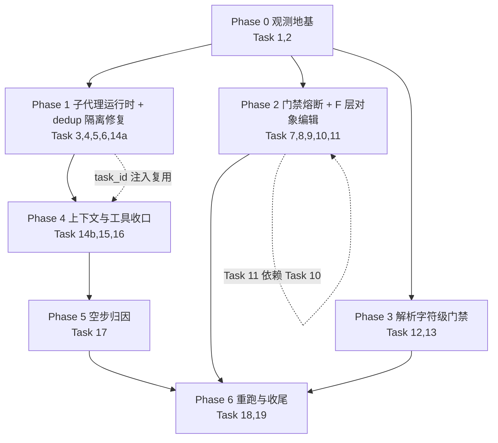

# Eligibility-Screener 优化 —— 分阶段开发计划（执行编排）

> 方案与根因分析见：[`./2026-08-09-eligibility-screener-gate-loop-and-subagent-context-plan.md`](./2026-08-09-eligibility-screener-gate-loop-and-subagent-context-plan.md)（下称**主计划**，19 个 Task 的目标/实现要点/测试/Demo 全部在那里，本文件不重复）
>
> 本文件只回答一件事：**这 19 个 Task 按什么顺序、切成几个可独立验证的批次、每批次的退出门与回滚路径是什么。**
>
> 日期：2026-08-10（CST） · 状态：**待评审 / 未开工**

---

## 1. 三条交付硬约束（先读，它们决定了批次怎么切）

### 1.1 一半的改动落在 gitignored 文件上

`.gitignore` 明确忽略：`config.yaml`（27 行）、`.deer-flow/`（38 行）、`skills/custom/*`（40 行）。

即：主计划里的 **Task 7、8、9、11、12、13、16** 改的是 `skills/custom/**` 与 `backend/.deer-flow/agents/eligibility-screener/SOUL.md`，**Task 14b、19** 改 `config.yaml` —— 这些文件**不进 git**，没有 diff、没有 code review、没有回滚点。

**应对（每个改动 skill/SOUL/config 的阶段都必须做）**：

1. 动手前对 `skills/custom/` 与 `SOUL.md` 做快照（仓库已有先例：`backend/.deer-flow/agents/agents.zip`），快照文件名带日期与阶段号；
2. 改动内容以 **patch 片段 + 改动说明**写入该阶段的 changelog（`docs/eligibility-screener-gate-loop-optimization-changelog.md`，主计划 Task 19），让评审有可读对象；
3. 契约测试是唯一的自动化护栏（`tests/skills/test_soul_skill_contract.py` / `test_skill_slimming_contract.py`），因此**规则改写必须同步改契约断言**，否则改动等于无人看守。

### 1.2 CI 看不见 skill 脚本测试

`tests/skills/*` 在技能未安装时**整模块 skip**（例：`test_uncertain_recheck.py` 的 `if not SCRIPT_PATH.exists(): pytest.skip(..., allow_module_level=True)`）。干净 checkout 的 CI 会全部跳过并显示"绿"。

**应对**：skill 脚本类任务（Task 7/8/9/12/13）的退出门必须是**本地实跑截图/输出**，并在 changelog 记录 `passed/skipped` 数量；不得以 CI 绿灯作为完成依据。

### 1.3 没有仓库根 pytest 入口

`backend/Makefile` 的 `test` 目标只跑 `tests/`（backend 内），仓库根**没有** `pytest.ini` / `pyproject.toml` / Makefile test 目标覆盖 `tests/skills/`。

**应对（本计划统一使用的三条命令）**：

```bash
# 后端全量（含新增中间件/脚本测试）
cd backend && make test

# 单文件定向
cd backend && PYTHONPATH=. uv run pytest tests/test_read_file_dedup_middleware.py -v

# skill 脚本测试（借用 backend 的 uv 环境跑仓库根 tests/skills）
cd backend && uv run pytest ../tests/skills -q

# 提交前
cd backend && make lint && make format
```

> 顺手建议（低成本、非阻塞）：给根 `Makefile` 补一个 `test-skills` 目标，把上面第三条命令固化下来。列为 Phase 6 的可选收尾项。

---

## 2. 开工前必须敲定的决策（否则对应阶段无法开始）

主计划 §15 有 10 个决策点，其中 **4 个是开工阻塞项**：

| 决策点 | 阻塞阶段 | 建议默认值（评审不反对即按此执行） |
|---|---|---|
| #9 dedup 子代理隔离修法 (a) task_id 入 key / (b) 缓存降实例级 | Phase 1 | **(a)**：`task_id` 同时被 Task 3 的累计计数与 Task 1 的按 task 归集指标复用，一次注入三处受益 |
| #1 子代理 summarization 的 trigger / keep 初值 | Phase 1 | trigger 从宽起步（明显高于 lead 的 50k），keep 用 token 而非条数；重跑后收紧 |
| #2 子代理预算上限 + 超限默认档 | Phase 1 | 判定类 task 默认**优雅收尾 + `stuck_items`**；QC 类默认**失败上报** |
| #6 F 层工具命名与兼容策略 | Phase 2 | **(a)** 在 `apply_json_patches` 内同时支持两种 patch 形态、保留原工具名（既有 13 项断言与硬编码文案不动） |

其余 6 个（#3 熔断轮次 N、#4 空步熔断、#5 dedup 本轮是否启用、#7 RBW 关系、#8 `remove` 授权、#10 `view_image`）可以在对应阶段开工时再定，不阻塞排期。

---

## 3. 依赖关系与批次



**为什么是这个顺序**：

- **Phase 0 必须最前**：`2d628340` 因 run 未收尾被漏算 17.2M，没有可信口径时后续任何"优化了多少"都无法证明。
- **Phase 1 优先于 Phase 2**：主计划 §2 的结论是"门禁误报是点火器、子代理无压缩无熔断是放大器"。先封顶爆炸（放大器），再修点火器，这样 Phase 2 的收益能被干净地测出来，而不是被上下文膨胀掩盖。
- **Task 14a 提前到 Phase 1**：它与 Task 5 改同一个文件（`subagents/executor.py` 的 context 注入），与 Task 3 共用同一个 `task_id` 维度。三者同批可省两次回归。**但 `read_file_dedup.enabled` 仍保持 `false`**，启用推到 Phase 4。
- **Phase 2 内部 Task 11 依赖 Task 10**：规则不能指向一个还不存在的工具。
- **Phase 3 可与 Phase 1/2 并行**（改的是 `criteria-parser` 脚本，与判定链无文件重叠），若人力只有一人则顺序执行。

---

## 4. 分阶段实施细则

每阶段固定五段：范围 / 改动面 / 开关 / 退出门 / 回滚。

### Phase 0 — 观测地基（Task 1, 2）· ✅ 2026-08-10 完成

> 实施记录与完整验证输出见 [changelog Phase 0](../eligibility-screener-gate-loop-optimization-changelog.md#phase-0--观测地基task-1-2-2026-08-10--完成)。
> 退出门结果：① 新增 15 项单测全绿（30 项既存失败与本改动无关，已举证）；② `d393714d` = 27,613,341 ≈ 27.6M ✅；③ **无法实况复现**（幽灵 run 已收尾，改由单测守护）；④ delta **+54.5%** ✅。
> 附带结论：`empty_ai_steps_no_tool_calls` 在两次会话 25 个 task 上全为 0 → **Phase 5 的前提被证否**，该阶段降级为"不做熔断"。


- **范围**：`analyze_eligibility_run.py` 交叉校验 + 不一致告警 + 4 个新指标；落两次会话基线 JSON。
- **改动面**：`backend/scripts/analyze_eligibility_run.py`；新增 `backend/tests/test_analyze_eligibility_run.py`；新增 `docs/baselines/{2d628340,d393714d}.json`。全部 in-git，可正常评审。
- **开关**：无（只读分析脚本，不影响运行时）。
- **退出门**：
  1. `cd backend && make test` 全绿；
  2. 对 `d393714d` 跑脚本，`total_tokens` 与手工 Postgres 快照的 **27.6M 一致**；
  3. 对 `2d628340` 跑脚本，**打出未收尾告警**（而非静默给出 628k）；
  4. `--baseline` 输出两次会话的 delta ≈ **+54%**。
- **回滚**：`git revert`，无运行时影响。

### Phase 1 — 子代理运行时三防线 + dedup 隔离修复（Task 3, 4, 5, 6, 14a）· ✅ 2026-08-10 完成

> 实施记录与完整验证输出见 [changelog Phase 1](../eligibility-screener-gate-loop-optimization-changelog.md#phase-1--子代理运行时三防线--dedup-隔离修复task-3-4-5-6-14a-2026-08-10--完成)。
> 退出门：三个中间件按配置接入且关闭时链形一致 ✅；累计计数跨窗口触发 ✅；`stop_reason` 进 `subagent.end.metadata` ✅；dedup 跨 task 首读拿正文 ✅；SOUL/skill 契约 107 passed ✅；全量回归 5908 passed / 30 既存失败（与 Phase 0 基线逐项相同，未引入新失败）。
> **实施中发现**：`SUBAGENT_MAX_RETRIES = 1` 是**代码层**的无条件重试（`task_tool.py:35`），单靠 prompt 规则拦不住 —— Task 6 因此改为「代码 + prompt 双管」。另：LoopDetection 早已有 `verification_*` 门禁脚本专用阈值，无需新建白名单。
> 三个新开关与 `read_file_dedup` 仍全部关闭，按 §5 顺序在后续阶段逐个灰度。


- **范围**：子代理接入 LoopDetection（累计计数）、子代理级 summarization、子代理级预算 + 优雅收尾、失败不得盲目重派（prompt）、dedup 的 `task_id` 隔离修复。
- **改动面**：
  - `agents/middlewares/tool_error_handling_middleware.py`（`build_subagent_runtime_middlewares`，225-274）
  - `agents/middlewares/loop_detection_middleware.py`（累计计数）
  - `config/subagents_config.py`（新增 `summarization` / `token_budget` 子配置；`AppConfig.subagents` 已存在，无需动 AppConfig 结构）
  - `subagents/executor.py`（591-608 注入 `task_id`；收尾路径 + `subagent.end` metadata）
  - `agents/middlewares/read_file_dedup_middleware.py`（`_cache_key` 纳入 task 维度）
  - `references/judge-delegation.md` + `SOUL.md`（**gitignored**，走 §1.1 流程）
- **开关（全部默认关，这是本阶段可以安全落地的前提）**：

  | 开关 | 默认 | 打开时机 |
  |---|---|---|
  | `subagents.loop_detection.enabled`（或复用全局 `loop_detection`） | 关 | Phase 1 退出门通过后灰度 |
  | `subagents.summarization.enabled` | 关 | 同上 |
  | `subagents.token_budget.enabled` | 关 | 同上 |
  | `read_file_dedup.enabled` | **保持 false** | Phase 4 |

- **退出门**：
  1. `cd backend && make test` 全绿；新增链形断言证明三个中间件**按配置**出现在子代理链中，且关闭时链形与改动前**逐项一致**；
  2. 12 次同参 bash 的子代理回放：第 3 次注入告警、第 5 次剥离 tool_calls（且间隔 > `window_size=20` 仍能触发）；
  3. 预算触顶走收尾路径而非 `GraphRecursionError`，`subagent.end.metadata` 带 `failure_reason` / `stuck_items`；
  4. **dedup 跨 task 回归**：同一 run 内不同 `task_id` 的首读必须拿到完整正文（这条即使 dedup 关闭也要写，作为 Phase 4 的前置资产）；
  5. `tests/skills/test_soul_skill_contract.py` 通过（**且 passed 数 > 0**，不是 skipped）。
- **回滚**：三个开关置 false 即恢复旧行为；`task_id` 注入是纯增量字段，无回滚需求。

### Phase 2 — 门禁分级熔断 + F 层对象级编辑（Task 7, 8, 9, 10, 11）· ✅ 2026-08-10 完成

> 实施记录见 [changelog Phase 2](../eligibility-screener-gate-loop-optimization-changelog.md#phase-2--门禁分级熔断--f-层对象级编辑task-7-8-9-10-11-2026-08-10--完成)。
> 决策点 6 按建议取 (a)：在 `apply_json_patches` 内同时支持两种 patch 形态、保留原工具名，既有 13 项断言未改。
> 退出门全绿（误报清零且召回不降、第 3 轮熔断、「111」一轮结束、三字段一次调用读 1 写 1）；全量回归 5940 passed / 30 既存失败。
> **实施中三次被自己的反向用例拦下**：① 参考区间过滤第一版把日期当区间，打掉了真实漏判召回；② OCR 乱码无法自动识别（表格分隔符 / 单位都会误判），改为只认显式 `ocr_corrupted`；③ 跨文档过滤必须能退化为「不过滤」，否则来源标签不同源时本闸静默失效。

- **范围**：`uncertain_recheck` 轮次账本 + 分级熔断、四项误报收紧、`unsourced_number` 分级、`edit_json` patch 语义升级、skill 规则反转 + 子代理白名单补齐。
- **改动面**：
  - in-git：`sandbox/tools.py`（`apply_json_patches_tool`，2031-2147）、`agents/middlewares/read_before_write_middleware.py:49`、`loop_detection_middleware.py:156`（写工具集合）、`subagents/builtins/{data_extractor,quality_control,bash_agent}.py`、`backend/tests/test_batch_json_patch_tool.py`
  - **gitignored**：`uncertain_recheck.py`、`check_reason_alignment.py`、两个 `SKILL.md`、`judgment-repair.md`、`criteria-repair.md`、`SOUL.md`
- **执行顺序（阶段内强制）**：Task 10（工具）→ Task 11（规则指向新工具）→ Task 7/8/9（门禁）。理由：规则不能指向不存在的工具；门禁改动会与改判链交互，放在工具与规则稳定之后。
- **开关**：无运行时开关。**风险由测试与轮次上限承担**，因此本阶段的测试要求最严：
  - Task 8 必须包含**真实漏判反向用例**（`S042002 IN-1` 知情同意、ECOG），`suspected_missed` 召回不得下降；
  - Task 10 既有 **13 项断言全绿不改**；
  - Task 7 的熔断只允许阻断级"失败上报"，禁止静默降级；`gate_escalated` 必须出现在 QC 核验清单。
- **退出门**：
  1. `cd backend && make test` 全绿；`cd backend && uv run pytest ../tests/skills -q` 全绿且 **passed 数覆盖 5 个改动脚本**；
  2. 对两次会话的真实产物重跑 `uncertain_recheck.py`：**误报清零**且已知真漏判仍报出；
  3. 同一 `suspected_missed` 集合第 3 轮触发熔断并输出 `stuck_items`；集合变化时计数重置；
  4. `IN-10-8` 的 "111" 场景一轮结束（不再出现改数字绕门禁）；
  5. 一条 `blocking_issues` 的 `conclusion` + `reason` + `exclusion_triggered` 三字段在**一次** `edit_json` 调用内改完，读 1 写 1。
- **回滚**：工具层保留旧 patch 形态 → 旧调用不受影响；skill 规则回滚依赖 §1.1 的快照。

### Phase 3 — 解析阶段字符级门禁（Task 12, 13）· ✅ 2026-08-10 完成

> 实施记录见 [changelog Phase 3](../eligibility-screener-gate-loop-optimization-changelog.md#phase-3--解析阶段字符级门禁可诊断task-12-13-2026-08-10--完成)。
> 退出门全绿：视觉等价字符折叠、OR 跨行拼接放行、6 项反向用例（比较符/数字/混入编造/乱序/过短/过多段）仍被拦、实跑回放四形态一次跑通。
> **实施中两次被实跑回放与单测拦下**：① 把 `或` 当分段符会把真实分支切到低于最小段长，反而拦住合法拼接；② `raw最相近片段` 的绝对阈值让单字符篡改被建议"整轨重做"——21 项单测全绿时这处误导仍在，是回放抓出来的。

- **范围**：闸9 失配诊断化；归一化扩展 + OR 分段匹配。
- **改动面**：`skills/custom/criteria-parser/scripts/check_track_structure.py`（`_norm_text` 133-139、闸9 约 508-540）—— **gitignored**；`tests/skills/test_check_track_structure.py`。
- **开关**：无。风险由"真实改写仍被拦"的回归用例承担。
- **退出门**：
  1. `·`(U+00B7) / 零宽 / 破折号 / 中英引号四类差异各自给出**失配偏移 + 最长匹配前缀 + 最相近片段**；
  2. 跨行 `a)b)c)` 拼接通过；**真实改写被拦**；乱序拼接被拦；过短分段被拒；
  3. 既有 `test_check_track_structure.py` 与 `test_or_group_split_gate.py` 全绿。
- **回滚**：快照恢复（§1.1）。

### Phase 4 — 上下文与工具收口（Task 14b, 15, 16）· ✅ 2026-08-10 完成

> 实施记录见 [changelog Phase 4](../eligibility-screener-gate-loop-optimization-changelog.md#phase-4--上下文与工具收口task-14b-15-16-2026-08-10--完成)。
> `read_file_dedup.enabled` 已置 `true`（本阶段唯一行为切换，回滚只需改回 `false`）。退出门 ①–⑤ 全绿；**⑥「单 task 读取 4→1、16→1」需真实重跑，移入 Phase 6 Task 18**。
> **实施中四条发现**：① 排序注释写的理由是错的（mark 由磁盘回读，与消息正文无关），结论恰好对；② 「引用指向 `.tool-results`」不能直接实现（外部化在更外层），改为按首读 `tool_call_id` 回查 transcript；③ glob 打不开 `/mnt/user-data` 不是权限问题——该虚拟根是三个目录的并集，且带斜杠形式会过校验后在深处误报 `path traversal detected`；④ `skill_manage` 把「action 写错」报成「这是内置技能」，agent 照着建议去创建技能。

- **范围**：启用 `read_file_dedup`（前置修复已在 Phase 1 完成）、工具层错误可自愈、禁内联生成结构化 JSON。
- **改动面**：`read_file_dedup_middleware.py`（引用文案、异步测试、可选删死代码）、`config.yaml` / `config.example.yaml`、`tool_error_handling_middleware.py:200-206`（更正排序注释）、`sandbox/tools.py`（grep 路径自愈、报错文案、glob 权限、`skill_manage`）、`backend/docs/middleware-execution-flow.md`、两个 skill 的规则与 `failure-archive.md`。
- **开关**：`read_file_dedup.enabled` 由 `false` → `true`（**本阶段唯一的行为切换**，可随时切回）。
- **退出门**：
  1. `awrap_tool_call` 与同步路径**行为一致**的测试通过（当前 14 项全同步，这是补齐项）；
  2. 跨 task 首读拿正文（Phase 1 的资产用例）在**启用状态**下仍通过；
  3. `read → str_replace → read` 第二次读**看到改动**；
  4. 外部化场景下引用文案指向**可读路径**，且不含"modify the file"类诱导措辞；
  5. 四类工具错误（grep 传文件路径 / bash 变量未展开 / glob 权限 / `skill_manage` ValueError）各有一条复现命令，改后返回可用结果或可执行修正；既有 `test_sandbox_tools_security.py` 的 `Unsafe absolute paths` 断言**不放松**；
  6. 单 task `SKILL.md` 读取 4→1、`judgments_draft_IN.json` 16→1。
- **回滚**：`read_file_dedup.enabled: false` 一键回退；工具层改动为增量兼容。
- ⛔ **`search_dedup` 不做**：`SearchDedupConfig` 是显式未实现占位，置 `true` 是空操作（主计划 §3.3）。

### Phase 5 — 空 AI 步归因（Task 17）· ⛔ 已证否，取消开发

- **Phase 0 实测结论**：两次会话全部 25 个 task 的 `empty_ai_steps_no_tool_calls` **均为 0** —— 空 text 的 AI 步全部携带 tool_call，是正常的工具调用轮次而非空转。文档报的 35% 数字正确、解释错误。
- **动作**：**不加熔断**，不做中间件改动。`empty_ai_steps_no_tool_calls` 留作守护指标，一旦 > 0 再重开。
- **对排期的影响**：关键路径少一环，`Phase 4 → Phase 6` 直连。

### Phase 5' — 子代理上下文压缩 + QC 步数治理 · ✅ 2026-08-10 完成（会话 `93d8a2c6` 复盘新增）

- **触发**：Phase 4 开 `read_file_dedup` 后重跑仅 -3.8%。实测原因：dedup 只命中 **2 次**（266 次读里同 task+同 path+同 range 的真重复仅 6 次，70% 的读带行范围），而 **input 占 98.9%**、独立内容仅 956k → **重传 18×**（最重判定 task 30×）。成本模型：**计费 input ≈ (AI 步数 / 2) × 累积内容量**。
- **两个杠杆**：倍数（`subagents.summarization`，trigger 80k / keep 40k，含「任务交接单」prompt 保 evidence 逐字锚点）+ 步数（`evidence_bundle.py` 把 QC 逐条 grep+read 取证压成一次读）。
- **实施记录**：[changelog Phase 5'](../eligibility-screener-gate-loop-optimization-changelog.md#phase-5--子代理上下文压缩--qc-步数治理-2026-08-10--完成)。全量 5975 passed / 30 既存失败；skill 815 passed。
- **四条发现**：① 单测全绿时产物仍把同一段原文贴三遍（跨条目窗口未去重，实跑才看出）；② `_truncate` 把标记加在截断之后 → 上限是假的；③ 超长时"怎么补读"的提示被自己截掉；④ 两次被自己的 skill 契约拦下（thread id 进正文、体积超限），两次都是契约对。
- ⏳ **收益待验证**：需重跑看 `middleware:summarize` 调用数、`token/AI 步`（基线 55,681）、QC 的 `read_file+grep` 调用数（基线 47）。

### Phase 6 — 集成重跑与收尾（Task 18, 19）

- **范围**：重跑 M019 与 S042002，出 delta；文档同步 + `stream_chunk_timeout`；可选补 `make test-skills`。
- **退出门**：主计划 §5 的 9 项指标 + §11.2 的 8 项核对逐条有数；**第 8 项（判定质量不退化）是硬门槛**——token 降但质量降的结果不予接受，须回到对应阶段。
- **回滚**：按阶段开关分级回退（见 §5）。

---

## 5. Feature flag 与灰度策略

所有后端行为改动都必须落在开关后面，且**默认关**。灰度顺序即 Phase 4 之后的一次性开关序列：

| 顺序 | 开关 | 观测什么 | 不达标时的动作 |
|---|---|---|---|
| 1 | `subagents.token_budget.enabled` | 单 task 峰值 token 是否被封顶；是否出现"半成品当完整结果" | 调阈值；确认 `stuck_items` 落地 |
| 2 | `subagents.loop_detection.enabled` | 门禁脚本重复调用是否在 3/5 次被拦；有无误伤合法重跑 | 提高门禁脚本类阈值或加白名单 |
| 3 | `subagents.summarization.enabled` | 累计 input 曲线是否转为锯齿；判定证据是否仍可取回 | 放宽 keep 窗口 |
| 4 | `read_file_dedup.enabled` | 单 task 同文件读取是否降到 1；子代理首读是否仍拿到正文 | 立即关闭并回到 Phase 1 的隔离修复 |

**一次只开一个**，每次开完跑一遍受影响患者，用 `--baseline` 归因。四个同时打开会让"哪个带来收益、哪个引入回归"无法区分。

---

## 6. 提交与评审粒度

| 批次 | 建议 commit / PR 切分 | 可评审性 |
|---|---|---|
| Phase 0 | 1 个 PR（脚本 + 测试 + 基线 JSON） | 完整 |
| Phase 1 | 3 个 commit：①`task_id` 注入 + dedup key（含跨 task 用例）②中间件接线 + 配置 ③executor 收尾路径 | 完整（prompt 部分走 changelog） |
| Phase 2 | 2 个 PR：①`edit_json` 工具层（in-git）②白名单 + 中间件写工具集合；skill 规则与门禁脚本走 changelog + 快照 | 部分（skill 不在 git） |
| Phase 3 | 全部 gitignored → 仅 changelog + 快照 + 测试输出 | 弱（依赖契约测试） |
| Phase 4 | 1 个 PR（中间件文案/测试/文档 + 工具层自愈）+ 1 次配置切换记录 | 完整 |
| Phase 5 | 分析结论写入 changelog；如加熔断则 1 个小 PR | 完整 |
| Phase 6 | 1 个 PR（文档同步 + 可选 `make test-skills`）+ 重跑报告 | 完整 |

约定：每个 PR 描述里写清 **改了什么 / 测了什么 / 哪些开关仍是关闭的**（README 的用户可见行为在开关打开前不需要改）。

---

## 7. 工期估算与关键路径

按一人全职、含测试与本地验证：

| 阶段 | 估算 | 关键路径 | 备注 |
|---|---|---|---|
| Phase 0 | 0.5–1 d | ✅ | 纯脚本，无运行时风险 |
| Phase 1 | 3–4 d | ✅ | 三个中间件接线 + 配置 + executor 收尾，测试量最大 |
| Phase 2 | 3–4 d | ✅ | `edit_json` 语义 + 5 个 skill 文件规则反转 + 门禁账本 |
| Phase 3 | 1–1.5 d | 可并行 | 纯脚本 + 归一化用例 |
| Phase 4 | 1.5–2 d | ✅ | dedup 启用 + 工具层四处自愈 |
| Phase 5 | 0.5 d | — | 主要是读数据下结论 |
| Phase 6 | 1–2 d | ✅ | 两次完整重跑本身就要 ~1.5h/次 + 逐条核对 |
| **合计** | **11–15 d** | | Phase 3 并行可省约 1 d |

关键路径：`Phase 0 → Phase 1 → Phase 4 → Phase 5 → Phase 6`（约 7–10 d），Phase 2 与之并行推进但必须在 Phase 6 之前合入。

---

## 8. 观测节奏（什么时候跑什么）

| 时点 | 命令 | 目的 |
|---|---|---|
| Phase 0 结束 | `analyze_eligibility_run.py <thread> --output docs/baselines/<id>.json` | 固化基线 |
| 每个开关打开后 | `analyze_eligibility_run.py <thread> --baseline docs/baselines/d393714d.json` | 单因子归因 |
| Phase 2 结束 | 对真实产物重跑 `uncertain_recheck.py` / `check_reason_alignment.py` | 误报清零 + 召回不降 |
| Phase 3 结束 | 对含全角与 OR 列表的原文重跑 `check_track_structure.py` | 字符循环消失 |
| Phase 6 | M019 与 S042002 各一次完整重跑 + `--baseline` | 终验收 |

---

## 9. 阻塞与升级路径

| 情况 | 处理 |
|---|---|
| 某阶段退出门有 1–2 项不达标，但不涉及判定质量 | 记入 changelog 的"已知差距"，允许进入下一阶段，Phase 6 汇总复核 |
| 退出门涉及**判定质量**（召回下降 / 错误排除 / 证据取不回） | **停止推进**，回到该阶段修复；开关一律关闭 |
| 灰度中出现无法归因的回归 | 关掉最近打开的那个开关，单独重跑该因子 |
| 决策点迟迟未定 | 按 §2 的"建议默认值"执行，并在 changelog 标注"按默认推进，未经评审确认" |

---

## 10. 与主计划的对应关系

| 本文件阶段 | 主计划 Task | 主计划章节 |
|---|---|---|
| Phase 0 | 1, 2 | §9.E、§10 阶段 1 |
| Phase 1 | 3, 4, 5, 6, 14（P0 部分） | §2、§9.A、§4ter.2 |
| Phase 2 | 7, 8, 9, 10, 11 | §9.B、§9.F、§4bis |
| Phase 3 | 12, 13 | §9.C |
| Phase 4 | 14（启用部分）, 15, 16 | §9.D、§4ter.3/4 |
| Phase 5 | 17 | §9.D/D4 |
| Phase 6 | 18, 19 | §11、§14.3 |
