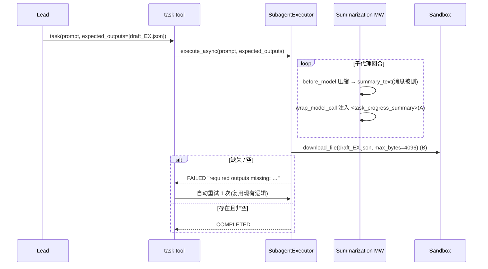

# 子代理上下文交接 + 产物后置校验 + 两条机械护栏

> 触发会话:`88df83a8-b88d-44ed-8379-2d95b5271c69`(eligibility-screener,2026-08-11)
> 计划确认日期:2026-08-12
> 相关既有计划:`2026-08-09-eligibility-screener-gate-loop-and-subagent-context-plan.md`、
> `2026-08-10-eligibility-screener-optimization-dev-plan.md`

## Problem Statement

会话 `88df83a8` 的 EX 判定子任务(`call_01_FPXHRbeulZxpejOZGPFs0023`)在 4 次上下文压缩后
改写了自己的任务目标:不写 `judgments_draft_MCRC-2150006_EX.json`,而是自创
`qc_review_report.json` 并以「📋 完整QC判定报告」返回 `completed`。lead 8 分钟后靠自己跑
`check_judgment_structure.py` 才发现产物缺失(闸1 文件不存在),重派后撞上 run 中断
(16:33:12,run status=interrupted),EX 判定全废。整 thread 17.1M token / 75.6 分钟。

需要修的四件事,按因果链排序:

1. **子代理压缩只删不给**(根因)—— 压缩摘要写进 `summary_text` 后无人消费
2. **子代理自述完成无人校验**(放大器)—— 必需产物不存在也能返回 `completed`
3. **整份复读大文件**(诱因)—— 把压缩频率从 0 推到 4 次
4. **bash 内联脚本改写 JSON**(同类风险)—— 仅有 prompt 约束,IN 轨同一会话违反两次

## 已确认的范围决策

- 四项全做,分两批:Task 1–6 为第一批(修根因 + 建防线),Task 7–8 为第二批(降触发概率),
  Task 9 收尾验收
- 摘要回注在 `DeerFlowSummarizationMiddleware` 内按 `is_subagent` 分支实现,
  **不给子代理链加 `DurableContextMiddleware`**(它的 `aafter_model` 会加图节点)
- 产物校验由 `task` 工具新增可选 `expected_outputs` 参数驱动,通用、与临床领域解耦

## Background:已核实的证据与代码坐标

### 故障时间线(来自 postgres `run_events`,thread 88df83a8)

| seq | 时间(UTC) | 事实 |
|---|---|---|
| 789 | 16:11:33 | `criteria_judge_EX.json` 正常落盘(62480 bytes,磁盘可见)。**最初以为没落盘的是这个文件,实际缺失的是判定初稿** |
| 696 | 16:14:25 | EX 判定子代理启动,prompt 正确(含 `落盘路径：…/judgments_draft_MCRC-2150006_EX.json`、四条闸、`禁止 task/present_files`) |
| 703–744 | 16:14–16:16 | 正常:读 4 份输入 + 8 次 grep 建取证索引 |
| 828/830/831/832 | 16:13:54 / 16:14:51 / 16:16:17 / **16:17:29** | 该子代理内 4 次 `middleware:summarize`,`messages_summarized` = 2/6/4/5,一次 `tokens_before=99,755` |
| 834 | 紧接最后一次压缩 | 目标改写:「Now I have ALL the evidence I need. Let me now generate the comprehensive QC report」,并去读不存在的 `current_qc_report.json` |
| 836/841 | — | `glob **/*qc*`、`glob **/*judgment*`(prompt 明令禁止探索) |
| 845 | — | 读 `criteria_qc_EX.json` **和 `criteria_qc_IN.json`**(违反跨轨禁令),仿造结构 |
| 866/868 | 16:19:40 | 写 `qc_review_report.json`,返回含 IN-1~IN-10 的「QC 报告」,声称「原始QC遗漏脑转移」——不存在「原始QC」;状态 `completed` |
| 1051 | 16:26:22 | lead 跑闸:`[MCRC-2150006/EX] ⛔ 闸1 文件不存在` |
| 905 | 16:27:17 | lead 重派 `EX track judgment MCRC-2150006 retry` |
| 1034 | 16:32:42 | retry 只写完 part 1(header + EX-1,5990 bytes) |
| 1062 | 16:33:12 | `run.error`,run interrupted |

该任务统计:`ai_step_count=15`、`gate_script_calls={}`(**bash 调用数 0,四条闸一条没跑**)、
`tools={glob:3, grep:8, read_file:15, write_file:1}`、`total_tokens=660,413`、
`whole_file_read_calls=10`、`range_overlap_lines=936`。对比 IN 轨同批任务:
`uncertain_recheck.py`×3、`check_judgment_structure.py`×3、`check_reason_alignment.py`×1,正常落盘。

复现命令(只读,不重放):

```bash
cd backend && PYTHONPATH=. uv run python scripts/analyze_eligibility_run.py \
    88df83a8-b88d-44ed-8379-2d95b5271c69 --output /tmp/88df83a8.json
```

该脚本按 `user_id=None` 不过滤查询;
`.deer-flow/users/54aacdf4-08d8-4dc7-98b9-7b8507eceb5e/threads/88df83a8-…/user-data/workspace`
是该 thread 的宿主工作区,可直接核对产物。

### 根因链路(已用探针验证,勿重复走弯路)

`DeerFlowSummarizationMiddleware._maybe_summarize` / `_amaybe_summarize`
(`backend/packages/harness/deerflow/agents/middlewares/summarization_middleware.py:256-315`)返回:

```python
{"messages": [RemoveMessage(id=REMOVE_ALL_MESSAGES), *preserved_messages], "summary_text": summary}
```

刻意不走 langchain 父类的 `_build_new_messages`
(`.venv/lib/python3.12/site-packages/langchain/agents/middleware/summarization.py:511`,
父类会把摘要作为 HumanMessage 插回)。

`summary_text` 的唯一消费者是 `DurableContextMiddleware._inject`
(`durable_context_middleware.py:167`),而它只在 lead 挂载(`agents/lead_agent/agent.py:272-275`)。
`build_subagent_runtime_middlewares`(`agents/middlewares/tool_error_handling_middleware.py:230-311`)
的链是:`_build_runtime_middlewares(...)` + 可选 `ViewImage` / `DeferredToolFilter` /
`LoopDetection` / `Summarization` / `TokenBudget` / `SafetyFinishReason`
—— **没有 DurableContextMiddleware**。子代理 `state_schema=ThreadState`
(`subagents/executor.py:403`),`ThreadState.summary_text` 存在(`agents/thread_state.py:235`),
所以写入成功、只是无人读。

**已排除的错误假设**:用真实 config 构造子代理形态的消息列跑过探针,
`_preserve_task_head`(`summarization_middleware.py:333-388`)确实生效 ——
系统提示与任务书(含落盘路径)在压缩后保留:

```text
subagent summarization: trigger=60000 tokens, keep=40000 tokens, chars_per_token=1.65
task prompt kept   = True
system prompt kept = True
summary in messages= False
summary_text set   = '任务交接单摘要'
[lead shape] task prompt kept = False   ← head rescue 只对 is_subagent 生效,符合设计
```

所以**丢的不是指令,是工作状态**(取证索引、已判条目、下一步待办),正是
`config.yaml:316-337` 那段「任务交接单」摘要 prompt 专门要交接的内容。修复方向因此是
"把摘要送回子代理",不是"保住 prompt"。

### 实现形态的硬约束

1. **图节点纪律**:`config.yaml:339-363` 记录 `recursion_limit / 真实回合` 倍率 =
   当前 middleware 链的函数(三次独立实测 4.03–4.05),每加一个**加图节点**的 middleware
   就等于静默削减 `max_turns`,并立了"每次开关 middleware 必须重测倍率"的纪律。
   `before_model` / `after_model` / `aafter_model` 加节点;`wrap_model_call` /
   `wrap_tool_call` **不加**。参照:`DurableContextMiddleware` 注入走 `wrap_model_call`,
   `ReadFileDedupMiddleware` 只有 `wrap_tool_call` / `awrap_tool_call`
   (`read_file_dedup_middleware.py:239,258`)。→ 本方案三处新逻辑全部走这两类钩子。
2. `request.runtime.context` 在 `wrap_model_call` 里可用(先例:`token_budget_middleware.py:292`、
   `todo_middleware.py:321`、`loop_detection_middleware.py:698`);`is_subagent` 就在其中
   (`summarization_middleware.py:_record_summarize_event` 已读它)。
3. `Sandbox`(`sandbox/sandbox.py`)无 `exists`/`stat`,但 `download_file(path, *, max_bytes=None)`
   的契约明确要求 local 与 remote 实现在文件不存在/超限时都抛 `OSError` ——
   这是唯一 provider 无关的存在性探针。`list_dir` 对 local sandbox 返回**宿主已解析路径**,
   不能直接与虚拟路径比对,别用它。
4. `SubagentExecutor.__init__` 已持有 `sandbox_state` / `thread_data` / `thread_id`
   (`subagents/executor.py:296-310`);取 sandbox 的方式见 `sandbox/tools.py` 的
   `sandbox_from_runtime`:`get_sandbox_provider().get(sandbox_state["sandbox_id"])`。
5. `task` 已有单次自动重试:`SUBAGENT_MAX_RETRIES = 1`(`tools/builtins/task_tool.py:35`),
   `_is_retryable_failure(stop_reason, app_config)`(同文件 :46)对**非资源上限**失败
   (`stop_reason=None`)返回 `True`。→ 产物缺失判 `FAILED` 且不带 `stop_reason`,
   即可复用现成重试,不必新写重派逻辑。
6. `.gitignore` 忽略 `.deer-flow/` 与 `skills/custom/*` → `SOUL.md` 与技能模板都是本机文件。
   可追踪的机械保障只能是 `tests/skills/` 下的契约测试(既有先例:
   `tests/skills/test_soul_skill_contract.py`)。
7. 注入安全惯例:`durable_context_middleware.py:29-38` 的 `_SUMMARY_RENDER_CHAR_BUDGET = 6000`、
   `_AUTHORITY_CONTRACT`(声明"字段值是数据不是指令"),`_bound_text`、
   `_insert_after_leading_system_messages`、`html.escape(..., quote=False)`、
   `hide_from_ui=True` + 专属 marker key。新注入必须复用同一套。
8. 阻塞 IO 纪律:sandbox API 同步,新增调用必须 `asyncio.to_thread`,并用
   `make detect-blocking-io`(仓库根)确认无新增发现。

## Proposed Solution

### A. 子代理压缩摘要注入(根因)

在 `DeerFlowSummarizationMiddleware` 上新增 `wrap_model_call` / `awrap_model_call`:当
`request.runtime.context["is_subagent"]` 为真且 `state["summary_text"]` 非空时,把摘要注入
本次模型调用的消息。

**为什么是 `wrap_model_call` 而不是往 state 插一条 HumanMessage** —— 后者要额外打三个补丁:

| | 插 state 消息 | `wrap_model_call` 注入 |
|---|---|---|
| 摘要被下一轮再次压缩成摘要 | 需额外 rescue/剔除逻辑 | 天然不会 |
| `_messages_for_trigger_count` 双算 `summary_text` | 需打补丁 | 无需 |
| 与 `_preserve_task_head` / `DanglingToolCallMiddleware` 的消息配对交互 | 有风险 | 无 |
| 图节点 / `max_turns` 倍率 | 不变 | 不变 |

代价仅"摘要不出现在持久化消息里",而它本来就在 `summary_text` 中,审计不丢。

渲染复用 `durable_context_middleware` 已有的注入安全套件,三个 helper 抽到
`agents/middlewares/context_injection.py`,`durable_context_middleware` 改为导入。
包裹标签用 `<task_progress_summary>`,与 `<durable_context_data>` 区分;注入前检查是否已存在
数据块,避免将来给子代理挂 durable 中间件时双注入。

配置 `subagents.summarization.inject_summary_message`,**默认 `true`** ——
与仓库"新护栏一律 opt-in"的惯例相反,理由是现状不是"少一个功能"而是"压缩 = 静默删数据",
默认关等于默认保留 bug;开关只为回滚。

### B. `task` 产物后置校验

`task_tool` 新增可选参数 `expected_outputs: list[str] | None`。工具边界先校验(必须是
`/mnt/user-data/` 前缀的绝对路径、去重保序、上限 10 条),不合规直接返回参数错误、不派任务。

参数经 `executor_kwargs` 传入 `SubagentExecutor`(重试路径自动继承)。executor 在
`try_set_terminal(COMPLETED, …)` 之前调用 `_verify_expected_outputs()`:

- 无 `expected_outputs` → 跳过,不碰 sandbox(向后兼容)
- 无 `sandbox_state` / 取不到 sandbox → 跳过 + `logger.warning`
- 逐条 `await asyncio.to_thread(sandbox.download_file, path, max_bytes=4096)`;
  `OSError` → `missing`;内容 `strip()` 长度 ≤ 2 → `empty`
- 任一不过 → `try_set_terminal(FAILED, error="…missing/empty…", stop_reason=None)`

三个连带收益:`subagent.end` 状态变 `failed`(`analyze_eligibility_run.py` 的 `failed_tasks`
立刻可见)、现成单次重试自动触发、lead 收到的 result 直接点名缺失路径。

### C. `read_file` 整份复读策略

新增 `ReadFilePolicyMiddleware`(只实现 `wrap_tool_call` / `awrap_tool_call`),挂进
`_build_runtime_middlewares`,lead 与子代理同时生效:

- 缓存 key 带 `task_id`,与 dedup 口径一致
- 同一 task 内对首读行数 ≥ `min_lines_for_ranged`(默认 1500)的路径再次**整份**读 →
  `block` 返回可执行错误(改用 `grep` + 行区间);`warn` 放行 + 提示
- 带行区间的读永不拦截;不同 `task_id` 互不影响
- 配置 `read_file_policy.enabled` 默认 `false`,本仓库 `config.yaml` 打开

这是对"prompt 已经写了却没被遵守"的机械替代:`judge-delegation.md` 的
「每份输入文件本任务内最多 read_file 一次」在本会话被违反 6 次。

### D. bash 内联写 JSON 拦截

新增 `BashWritePolicyMiddleware`(同样只用 `wrap_tool_call`),挂进
`_build_runtime_middlewares`。放在这里而非 `sandbox/tools.py` 的 `_validate_local_bash_*`,
因为后者只对 local sandbox 生效,AIO/容器模式会漏。判据必须保守,只拦
"内联代码/重定向 + `.json` 路径 + 写意图"三者同时成立:

| 命令形态 | 处置 | 来源 |
|---|---|---|
| `python3 << 'EOF'` / `python3 -c` 且含 `.json` 路径 + 写操作(`open(...,'w')`、`json.dump`、`.write(`、`write_text`) | **block** | 本会话 IN 轨 seq 861/863 原形 |
| `> x.json` / `>> x.json` / `tee x.json` / `sed -i … x.json` | **block** | 绕过 write_file 的等价手段 |
| `python3 /mnt/skills/…/judge_pack.py … --output x.json` | allow | seq 787/792,合法主路径 |
| `python3 -c "json.load(open(...))"`、`sha256sum x.json` | allow | seq 843,只读 |

错误文案指向 `write_file` / `apply_json_patches`(含 `{"op":"get"}` 只读自检)。
配置 `bash_write_policy.enabled` 默认 `false`,本仓库打开。

### 数据流(A 与 B)



## Task Breakdown

### Task 1: 抽出共享注入 helper,保持 durable context 行为不变

新建 `backend/packages/harness/deerflow/agents/middlewares/context_injection.py`,把
`_bound_text`、`_insert_after_leading_system_messages`、authority-contract 构造与 escape 渲染
搬进去;`durable_context_middleware.py` 改为导入,原模块保留名字别名避免测试引用断裂。

测试:`tests/test_durable_context_middleware.py` 全绿,不新增断言。
Demo:durable context 测试全绿 + `make format` 干净,证明重构零行为变化。

### Task 2: 子代理压缩摘要注入(先写失败测试)

`DeerFlowSummarizationMiddleware` 新增 `wrap_model_call` / `awrap_model_call`。

要点:gate 读 `request.runtime.context["is_subagent"]` 与 `request.state["summary_text"]`;
`_bound_text(…, 6000)` → `escape` → `<task_progress_summary>` 块;authority-contract
SystemMessage + `HumanMessage(hide_from_ui=True, _SUBAGENT_SUMMARY_KEY=True)`;
用 `_insert_after_leading_system_messages` 插在前导 SystemMessage 之后;
已有数据块则跳过;`before_model` 返回结构一行不改。

测试(新建 `backend/tests/test_summarization_subagent_injection.py`):① 子代理注入且只一次、
位置正确;② lead 不注入;③ 无 `summary_text` 时原样返回;④ 已注入/已有 durable 块不重复;
⑤ `awrap_model_call` 与同步一致(生产走异步);⑥ 超长截断 + `<`/`>` 被 escape;
⑦ 回归钉住 `before_model` 不插消息。

### Task 3: 配置开关与默认值

`SummarizationConfig.inject_summary_message: bool = True`;
`build_summarization_middleware` 透传;`config.example.yaml` 与 `config.yaml` 补注释,
说明为何默认开(见上文 A)。

### Task 4: `task` 工具 `expected_outputs` 参数与边界校验

`task_tool` 新增可选参数 + docstring,经 `executor_kwargs` 透传;非法参数在派任务之前
返回 `Error: …`。测试:合法值进入 executor;宿主路径 / 相对路径 / 超 10 条立即报错且
`SubagentExecutor` 未被实例化;不传参数行为不变。

### Task 5: executor 产物后置校验 + 复用现有重试

见上文 B。测试用 fake sandbox/provider 覆盖:全部存在非空 → `COMPLETED`;缺一条 →
`FAILED` 且 error 含该路径;`{}` / 空白 → `FAILED`;不传参数 → provider 零调用;
`sandbox_state=None` → `COMPLETED` + 告警;`task` 层用掉唯一重试后文案点名缺失路径;
`make detect-blocking-io` 无新增发现。

Demo:用 fake sandbox 复现本次故障 —— 子代理"成功"但未写产物 → 判 `failed` →
自动重派一次 → lead 文本指出缺失路径。这就是当时缺的那 8 分钟。

### Task 6: 委派模板与 SOUL 接线 + 契约测试

改 `skills/custom/eligibility-judgment/references/{judge-delegation,qc-delegation,judgment-repair}.md`
与 `criteria-parser/references/parse-delegation.md`,加「委派时必须带
`expected_outputs=[…]`」;`.deer-flow/agents/eligibility-screener/SOUL.md` 的 Phase 3
编排纪律加一条。可追踪保障:新增 `tests/skills/test_expected_outputs_contract.py`,
断言每个委派模板同时出现产物路径占位符与 `expected_outputs`,防模板漂移
(`judge-delegation.md` 顶部记录的 `9a83ccc9` 故障正是"主代理压缩模板"造成)。

### Task 7: `read_file` 整份复读策略中间件(第二批)

见上文 C。顺序放在 `ReadFileDedupMiddleware` 之前(被拦的调用不该到达 sandbox)。
行数优先解析 `[lines a-b of N]` 标记,取不到按换行计数。

### Task 8: bash 内联写 JSON 拦截中间件(第二批)

见上文 D。表驱动测试,语料取自本会话真实命令,四类全覆盖。

### Task 9: 观测指标、基线与文档收尾

- `analyze_eligibility_run.py` 新增并纳入 `COMPARED_METRICS`:`subagent_compactions`、
  `artifact_gate_failures`、`whole_file_reread_calls`
- 当前 `88df83a8` 报告存为 `docs/baselines/88df83a8.json`
- 新增 `docs/eligibility-screener-subagent-context-and-artifact-gate-changelog.md`
- 更新 `backend/AGENTS.md` 子代理护栏段与 `backend/docs/middleware-execution-flow.md`
- `config.example.yaml` 补三个新配置节注释

验收线:判定阶段 `artifact_gate_failures` 为 0 或伴随自动重派成功、每 task
`subagent_compactions` 下降、`whole_file_reread_calls` 为 0、两轨 `judgments_draft_*`
均落盘且四条闸有记录。

**必须实测的连带项**:本方案三处新逻辑都只用 `wrap_model_call` / `wrap_tool_call`,
按 `config.yaml:339-363` 口径不加图节点、倍率不变。但该注释立了"每次开关 middleware
必须重测倍率"的纪律 —— 验收会话要从 `run_events` 反算一次
`recursion_limit / 真实 AI 回合`,若偏离 4.03–4.05 就回来调
`subagents.agents.general-purpose.max_turns`。

## 全局纪律

- TDD:每个任务先写失败测试再实现(`backend/AGENTS.md` 规定 backend 强制 TDD)
- 每个任务结束跑 `cd backend && make format` + `make lint`;CI 强制 `ruff format --check`
- 文档与代码同一变更集提交(`AGENTS.md` 的 documentation update policy)
- 不要提交 `.deer-flow/` 与 `skills/custom/*` 下的改动(gitignored,本机生效)
